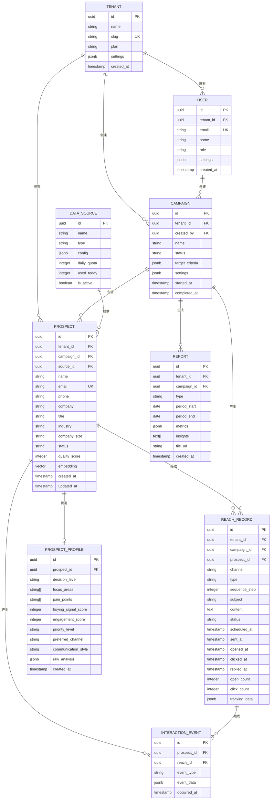
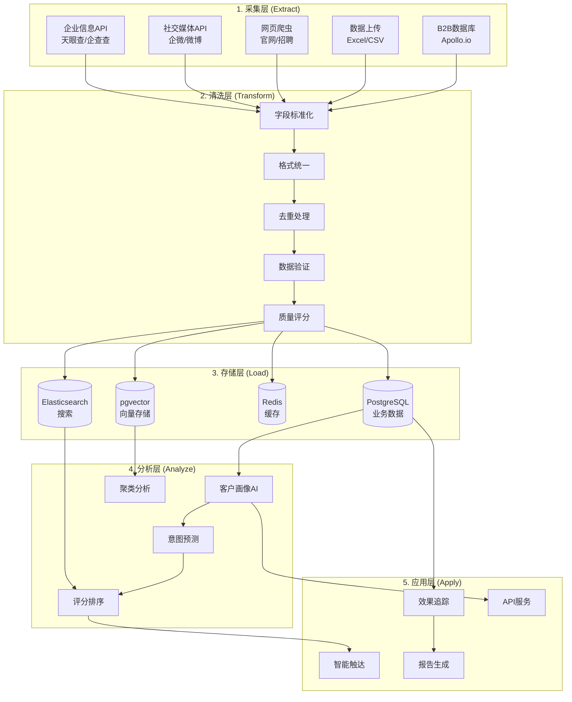
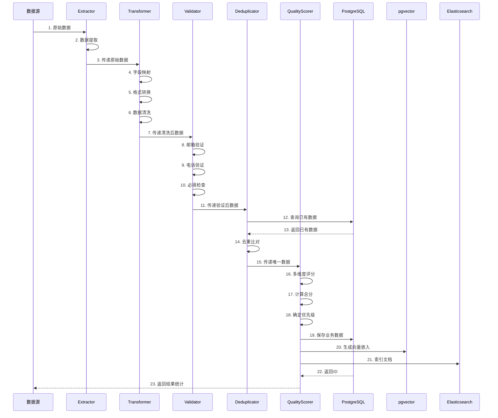
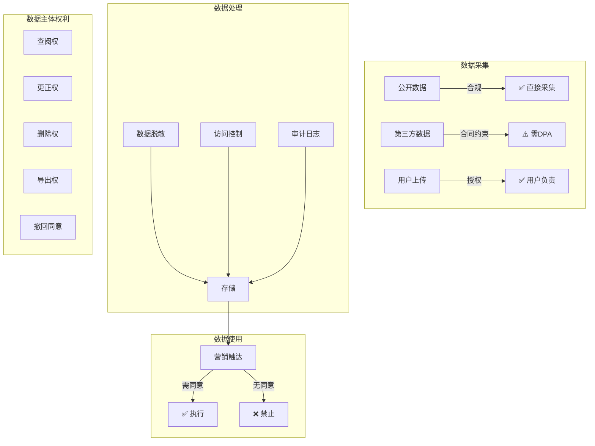

# 拓客Agent - 数据采集与处理方案

> 文档版本：V1.0 | 日期：2026-03-10
> 设计人：小data (数据调控中心)

---

## 概述

本文档定义拓客Agent的数据采集、存储、处理和合规方案，是整个系统的数据基础设施。

---

## 一、数据源调研

### 1.1 企业信息平台API对比

| 平台 | 数据覆盖 | API可用性 | 定价 | 数据质量 | 合规性 | 推荐度 |
|------|----------|-----------|------|----------|--------|--------|
| **天眼查** | 2.8亿+企业 | ✅ 有API | ¥0.02-0.05/次 | ⭐⭐⭐⭐⭐ | ✅ 合规 | ⭐⭐⭐⭐⭐ |
| **企查查** | 2.5亿+企业 | ✅ 有API | ¥0.02-0.08/次 | ⭐⭐⭐⭐⭐ | ✅ 合规 | ⭐⭐⭐⭐⭐ |
| **爱企查** | 百度旗下 | ✅ 有API | ¥0.01-0.03/次 | ⭐⭐⭐⭐ | ✅ 合规 | ⭐⭐⭐⭐ |
| **启信宝** | 2亿+企业 | ✅ 有API | ¥0.03-0.10/次 | ⭐⭐⭐⭐ | ✅ 合规 | ⭐⭐⭐⭐ |
| **Apollo.io** | 2.1亿联系人 | ✅ 有API | $49-99/月 | ⭐⭐⭐⭐⭐ | ✅ 海外合规 | ⭐⭐⭐⭐(出海) |
| **ZoomInfo** | 企业级数据 | ✅ 有API | $15K+/年 | ⭐⭐⭐⭐⭐ | ✅ 海外合规 | ⭐⭐⭐(贵) |
| **Hunter.io** | 1亿+邮箱 | ✅ 有API | $49-399/月 | ⭐⭐⭐⭐ | ✅ | ⭐⭐⭐ |

### 1.2 社交媒体接口

| 平台 | 数据类型 | API可用性 | 访问方式 | 限制 | 合规要点 |
|------|----------|-----------|----------|------|----------|
| **LinkedIn** | 职业档案 | ⚠️ 受限 | 官方API需商务合作 | 严格 | 需用户授权 |
| **企业微信** | 企业通讯录 | ✅ 有API | 企微开放平台 | 需企业认证 | 内部数据 |
| **微信公众号** | 公开文章 | ⚠️ 无官方API | 网页爬取 | 需代理 | 遵守robots.txt |
| **微博** | 公开内容 | ✅ 有API | 开放平台 | 频率限制 | 需备案 |
| **知乎** | 公开内容 | ⚠️ 无官方API | 网页爬取 | 反爬机制 | 遵守ToS |

### 1.3 公开数据爬取

| 数据源 | 数据类型 | 爬取难度 | 更新频率 | 合规性 |
|--------|----------|----------|----------|--------|
| 公司官网 | 联系方式、产品信息 | 低 | 中 | ✅ 公开数据 |
| 新闻媒体 | 公司动态 | 低 | 高 | ✅ 公开数据 |
| 招聘网站 | 职位、规模 | 中 | 高 | ⚠️ 需遵守ToS |
| 行业报告 | 市场趋势 | 中 | 低 | ⚠️ 版权注意 |
| 政府公开数据 | 工商、资质 | 低 | 中 | ✅ 公开数据 |

### 1.4 行业数据库

| 数据库 | 数据类型 | 获取方式 | 覆盖范围 | 成本 |
|--------|----------|----------|----------|------|
| 国家企业信用信息公示系统 | 工商登记 | 免费API | 全国 | 免费 |
| 中国裁判文书网 | 法律风险 | 网页爬取 | 全国 | 免费 |
| 专利数据库 | 知识产权 | API | 全球 | 部分免费 |
| 招投标平台 | 商业机会 | API/爬取 | 全国 | 付费 |

---

## 二、数据库设计

### 2.1 ER图 (Mermaid)



### 2.2 核心表DDL

```sql
-- 启用扩展
CREATE EXTENSION IF NOT EXISTS "uuid-ossp";
CREATE EXTENSION IF NOT EXISTS "pgvector";

-- 租户表
CREATE TABLE tenants (
    id UUID PRIMARY KEY DEFAULT uuid_generate_v4(),
    name VARCHAR(255) NOT NULL,
    slug VARCHAR(100) UNIQUE NOT NULL,
    plan VARCHAR(50) DEFAULT 'basic',
    settings JSONB DEFAULT '{}',
    created_at TIMESTAMPTZ DEFAULT NOW(),
    updated_at TIMESTAMPTZ DEFAULT NOW()
);

-- 用户表
CREATE TABLE users (
    id UUID PRIMARY KEY DEFAULT uuid_generate_v4(),
    tenant_id UUID REFERENCES tenants(id) ON DELETE CASCADE,
    email VARCHAR(255) UNIQUE NOT NULL,
    password_hash VARCHAR(255),
    name VARCHAR(255),
    role VARCHAR(50) DEFAULT 'member',
    settings JSONB DEFAULT '{}',
    is_active BOOLEAN DEFAULT true,
    created_at TIMESTAMPTZ DEFAULT NOW(),
    updated_at TIMESTAMPTZ DEFAULT NOW()
);

-- 数据源表
CREATE TABLE data_sources (
    id UUID PRIMARY KEY DEFAULT uuid_generate_v4(),
    tenant_id UUID REFERENCES tenants(id) ON DELETE CASCADE,
    name VARCHAR(100) NOT NULL,
    type VARCHAR(50) NOT NULL,  -- api, scrape, upload
    config JSONB DEFAULT '{}',
    daily_quota INTEGER DEFAULT 1000,
    used_today INTEGER DEFAULT 0,
    last_reset_date DATE DEFAULT CURRENT_DATE,
    is_active BOOLEAN DEFAULT true,
    created_at TIMESTAMPTZ DEFAULT NOW()
);

-- 拓客活动表
CREATE TABLE campaigns (
    id UUID PRIMARY KEY DEFAULT uuid_generate_v4(),
    tenant_id UUID REFERENCES tenants(id) ON DELETE CASCADE,
    created_by UUID REFERENCES users(id),
    name VARCHAR(255) NOT NULL,
    description TEXT,
    status VARCHAR(50) DEFAULT 'draft',
    target_criteria JSONB,
    settings JSONB DEFAULT '{}',
    started_at TIMESTAMPTZ,
    completed_at TIMESTAMPTZ,
    created_at TIMESTAMPTZ DEFAULT NOW(),
    updated_at TIMESTAMPTZ DEFAULT NOW()
);

-- 线索表（核心）
CREATE TABLE prospects (
    id UUID PRIMARY KEY DEFAULT uuid_generate_v4(),
    tenant_id UUID REFERENCES tenants(id) ON DELETE CASCADE,
    campaign_id UUID REFERENCES campaigns(id) ON DELETE SET NULL,
    source_id UUID REFERENCES data_sources(id),
    
    -- 基础信息
    name VARCHAR(255),
    email VARCHAR(255),
    phone VARCHAR(50),
    company VARCHAR(255),
    title VARCHAR(255),
    
    -- 公司信息
    industry VARCHAR(100),
    company_size VARCHAR(50),
    company_website VARCHAR(255),
    company_address TEXT,
    
    -- 社交链接
    linkedin_url VARCHAR(255),
    wechat_id VARCHAR(100),
    
    -- 状态与评分
    status VARCHAR(50) DEFAULT 'new',
    quality_score INTEGER,
    priority_level VARCHAR(10) DEFAULT 'C',
    
    -- 向量嵌入（用于相似度搜索）
    embedding vector(1536),
    
    -- 元数据
    raw_data JSONB,
    tags TEXT[],
    
    -- 合规字段
    consent_status VARCHAR(50) DEFAULT 'unknown',
    consent_at TIMESTAMPTZ,
    opt_out_at TIMESTAMPTZ,
    
    created_at TIMESTAMPTZ DEFAULT NOW(),
    updated_at TIMESTAMPTZ DEFAULT NOW(),
    
    -- 唯一约束（租户+邮箱）
    UNIQUE(tenant_id, email)
);

-- 客户画像表
CREATE TABLE prospect_profiles (
    id UUID PRIMARY KEY DEFAULT uuid_generate_v4(),
    prospect_id UUID REFERENCES prospects(id) ON DELETE CASCADE,
    
    -- 角色特征
    decision_level VARCHAR(50),
    focus_areas TEXT[],
    possible_kpis TEXT[],
    typical_concerns TEXT[],
    
    -- 需求分析
    pain_points TEXT[],
    buying_motivations TEXT[],
    expected_solutions TEXT[],
    budget_indicator VARCHAR(50),
    
    -- 意向评估
    buying_signal_score INTEGER,
    engagement_score INTEGER,
    priority_level VARCHAR(10),
    confidence_score FLOAT,
    
    -- 触达建议
    preferred_channel VARCHAR(50),
    communication_style VARCHAR(50),
    best_reach_time VARCHAR(50),
    recommended_topics TEXT[],
    avoid_topics TEXT[],
    
    -- AI原始分析
    raw_analysis JSONB,
    model_version VARCHAR(50),
    
    created_at TIMESTAMPTZ DEFAULT NOW(),
    updated_at TIMESTAMPTZ DEFAULT NOW()
);

-- 触达记录表
CREATE TABLE reach_records (
    id UUID PRIMARY KEY DEFAULT uuid_generate_v4(),
    tenant_id UUID REFERENCES tenants(id) ON DELETE CASCADE,
    campaign_id UUID REFERENCES campaigns(id) ON DELETE SET NULL,
    prospect_id UUID REFERENCES prospects(id) ON DELETE SET NULL,
    
    -- 触达信息
    channel VARCHAR(50) NOT NULL,
    type VARCHAR(50) NOT NULL,
    sequence_step INTEGER DEFAULT 1,
    
    -- 内容
    subject VARCHAR(500),
    content TEXT,
    content_hash VARCHAR(64),
    
    -- 状态
    status VARCHAR(50) DEFAULT 'pending',
    
    -- 时间戳
    scheduled_at TIMESTAMPTZ,
    sent_at TIMESTAMPTZ,
    delivered_at TIMESTAMPTZ,
    opened_at TIMESTAMPTZ,
    first_clicked_at TIMESTAMPTZ,
    replied_at TIMESTAMPTZ,
    bounced_at TIMESTAMPTZ,
    
    -- 追踪数据
    open_count INTEGER DEFAULT 0,
    click_count INTEGER DEFAULT 0,
    tracking_data JSONB,
    
    -- 外部ID
    external_message_id VARCHAR(255),
    
    created_at TIMESTAMPTZ DEFAULT NOW()
);

-- 交互事件表（时序数据）
CREATE TABLE interaction_events (
    id UUID PRIMARY KEY DEFAULT uuid_generate_v4(),
    tenant_id UUID REFERENCES tenants(id) ON DELETE CASCADE,
    prospect_id UUID REFERENCES prospects(id) ON DELETE CASCADE,
    reach_id UUID REFERENCES reach_records(id) ON DELETE SET NULL,
    
    -- 事件信息
    event_type VARCHAR(50) NOT NULL,  -- open, click, reply, bounce, unsubscribe
    event_data JSONB,
    
    -- 追踪
    ip_address VARCHAR(45),
    user_agent TEXT,
    referrer TEXT,
    
    occurred_at TIMESTAMPTZ DEFAULT NOW()
);

-- 分析报告表
CREATE TABLE reports (
    id UUID PRIMARY KEY DEFAULT uuid_generate_v4(),
    tenant_id UUID REFERENCES tenants(id) ON DELETE CASCADE,
    campaign_id UUID REFERENCES campaigns(id) ON DELETE SET NULL,
    
    type VARCHAR(50) NOT NULL,
    period_start DATE,
    period_end DATE,
    
    -- 报告数据
    metrics JSONB,
    insights TEXT[],
    recommendations TEXT[],
    
    -- 文件
    file_url VARCHAR(500),
    file_format VARCHAR(20),
    
    created_at TIMESTAMPTZ DEFAULT NOW()
);

-- 数据处理日志表
CREATE TABLE etl_logs (
    id UUID PRIMARY KEY DEFAULT uuid_generate_v4(),
    tenant_id UUID REFERENCES tenants(id) ON DELETE CASCADE,
    job_type VARCHAR(50) NOT NULL,
    source VARCHAR(100),
    
    -- 统计
    total_records INTEGER,
    success_count INTEGER,
    failure_count INTEGER,
    duplicate_count INTEGER,
    
    -- 状态
    status VARCHAR(50) NOT NULL,
    error_message TEXT,
    
    started_at TIMESTAMPTZ,
    completed_at TIMESTAMPTZ,
    created_at TIMESTAMPTZ DEFAULT NOW()
);

-- 创建索引
CREATE INDEX idx_prospects_tenant ON prospects(tenant_id);
CREATE INDEX idx_prospects_campaign ON prospects(campaign_id);
CREATE INDEX idx_prospects_email ON prospects(email);
CREATE INDEX idx_prospects_status ON prospects(status);
CREATE INDEX idx_prospects_quality ON prospects(quality_score DESC);

CREATE INDEX idx_reach_records_prospect ON reach_records(prospect_id);
CREATE INDEX idx_reach_records_campaign ON reach_records(campaign_id);
CREATE INDEX idx_reach_records_status ON reach_records(status);
CREATE INDEX idx_reach_records_scheduled ON reach_records(scheduled_at);

CREATE INDEX idx_interaction_events_prospect ON interaction_events(prospect_id);
CREATE INDEX idx_interaction_events_type ON interaction_events(event_type);
CREATE INDEX idx_interaction_events_time ON interaction_events(occurred_at DESC);

-- 向量索引（相似度搜索）
CREATE INDEX idx_prospects_embedding ON prospects 
    USING ivfflat (embedding vector_cosine_ops) WITH (lists = 100);

-- 全文搜索索引
CREATE INDEX idx_prospects_search ON prospects 
    USING GIN (to_tsvector('english', 
        COALESCE(name, '') || ' ' || 
        COALESCE(company, '') || ' ' || 
        COALESCE(title, '') || ' ' ||
        COALESCE(industry, '')
    ));

-- 更新时间触发器
CREATE OR REPLACE FUNCTION update_updated_at()
RETURNS TRIGGER AS $$
BEGIN
    NEW.updated_at = NOW();
    RETURN NEW;
END;
$$ LANGUAGE plpgsql;

CREATE TRIGGER update_prospects_updated_at
    BEFORE UPDATE ON prospects
    FOR EACH ROW EXECUTE FUNCTION update_updated_at();

CREATE TRIGGER update_profiles_updated_at
    BEFORE UPDATE ON prospect_profiles
    FOR EACH ROW EXECUTE FUNCTION update_updated_at();
```

### 2.3 pgvector向量存储设计

```sql
-- 向量嵌入用途
-- 1. 相似线索搜索：找到类似的潜在客户
-- 2. 聚类分析：自动分组相似客户
-- 3. 推荐系统：推荐相似画像的触达策略

-- 生成向量嵌入
-- 使用OpenAI text-embedding-3-small (1536维)
-- 输入：name + title + company + industry + company_size

-- 相似线索搜索示例
SELECT 
    p.id,
    p.name,
    p.company,
    1 - (p.embedding <=> query_vector) as similarity
FROM prospects p
WHERE p.tenant_id = :tenant_id
ORDER BY p.embedding <=> query_vector
LIMIT 10;

-- 向量嵌入更新函数
CREATE OR REPLACE FUNCTION update_prospect_embedding(
    p_prospect_id UUID,
    p_embedding vector
)
RETURNS void AS $$
BEGIN
    UPDATE prospects
    SET embedding = p_embedding,
        updated_at = NOW()
    WHERE id = p_prospect_id;
END;
$$ LANGUAGE plpgsql;
```

---

## 三、ETL流水线

### 3.1 数据流图



### 3.2 ETL详细流程



### 3.3 ETL实现代码

```python
# etl/pipeline.py
from typing import List, Dict, Optional
from dataclasses import dataclass
from datetime import datetime
import asyncio
import hashlib

@dataclass
class ETLResult:
    """ETL执行结果"""
    total: int
    success: int
    failure: int
    duplicates: int
    errors: List[str]

class ETLPipeline:
    """ETL流水线"""
    
    def __init__(self, db_session, vector_client, es_client):
        self.db = db_session
        self.vector = vector_client
        self.es = es_client
        
        self.extractor = Extractor()
        self.transformer = Transformer()
        self.validator = Validator()
        self.deduplicator = Deduplicator(db_session)
        self.scorer = QualityScorer()
    
    async def run(
        self, 
        source: str, 
        raw_data: List[Dict],
        tenant_id: str,
        campaign_id: Optional[str] = None
    ) -> ETLResult:
        """执行完整ETL流程"""
        
        result = ETLResult(
            total=len(raw_data),
            success=0,
            failure=0,
            duplicates=0,
            errors=[]
        )
        
        processed = []
        
        for raw in raw_data:
            try:
                # 1. Extract
                extracted = await self.extractor.extract(source, raw)
                
                # 2. Transform
                transformed = await self.transformer.transform(extracted)
                
                # 3. Validate
                validated = await self.validator.validate(transformed)
                if not validated:
                    result.failure += 1
                    continue
                
                # 4. Deduplicate
                is_dup = await self.deduplicator.check(
                    tenant_id, 
                    validated.email, 
                    validated.company
                )
                if is_dup:
                    result.duplicates += 1
                    continue
                
                # 5. Score
                scored = await self.scorer.score(validated)
                
                processed.append(scored)
                result.success += 1
                
            except Exception as e:
                result.failure += 1
                result.errors.append(str(e))
        
        # 6. 批量保存
        if processed:
            await self._save_batch(processed, tenant_id, campaign_id)
        
        # 7. 记录日志
        await self._log_result(source, result)
        
        return result
    
    async def _save_batch(
        self, 
        prospects: List, 
        tenant_id: str,
        campaign_id: Optional[str]
    ):
        """批量保存"""
        
        # 保存到PostgreSQL
        prospect_ids = await self.db.bulk_insert_prospects(
            prospects, tenant_id, campaign_id
        )
        
        # 生成向量嵌入
        embeddings = await self._generate_embeddings(prospects)
        
        # 更新向量
        await self.db.bulk_update_embeddings(prospect_ids, embeddings)
        
        # 索引到Elasticsearch
        await self.es.bulk_index(prospects, prospect_ids)
    
    async def _generate_embeddings(self, prospects: List) -> List:
        """生成向量嵌入"""
        from openai import AsyncOpenAI
        client = AsyncOpenAI()
        
        texts = [
            f"{p.name} {p.title} {p.company} {p.industry}"
            for p in prospects
        ]
        
        response = await client.embeddings.create(
            model="text-embedding-3-small",
            input=texts
        )
        
        return [e.embedding for e in response.data]
    
    async def _log_result(self, source: str, result: ETLResult):
        """记录ETL日志"""
        await self.db.insert_etl_log(
            job_type="prospect_import",
            source=source,
            total_records=result.total,
            success_count=result.success,
            failure_count=result.failure,
            duplicate_count=result.duplicates,
            status="completed" if result.failure < result.total else "failed"
        )


# etl/transformer.py
class Transformer:
    """数据转换器"""
    
    FIELD_MAPPING = {
        # 中文 -> 英文
        "姓名": "name",
        "名字": "name",
        "联系人": "name",
        "公司": "company",
        "公司名称": "company",
        "企业": "company",
        "职位": "title",
        "职务": "title",
        "邮箱": "email",
        "电子邮件": "email",
        "邮件": "email",
        "电话": "phone",
        "手机": "phone",
        "联系方式": "phone",
        "行业": "industry",
        "网址": "website",
        "网站": "website",
    }
    
    async def transform(self, raw: Dict) -> Dict:
        """转换数据"""
        transformed = {}
        
        # 1. 字段映射
        for key, value in raw.items():
            mapped_key = self.FIELD_MAPPING.get(key, key.lower())
            transformed[mapped_key] = value
        
        # 2. 格式标准化
        if "email" in transformed:
            transformed["email"] = self._normalize_email(transformed["email"])
        
        if "phone" in transformed:
            transformed["phone"] = self._normalize_phone(transformed["phone"])
        
        if "company" in transformed:
            transformed["company"] = self._normalize_company(transformed["company"])
        
        # 3. 数据清洗
        transformed = self._clean_data(transformed)
        
        return transformed
    
    def _normalize_email(self, email: str) -> str:
        """邮箱标准化"""
        if not email:
            return ""
        email = email.lower().strip()
        email = email.replace(" ", "")
        # 移除常见拼写错误
        if email.endswith(".comcom"):
            email = email[:-4]
        return email
    
    def _normalize_phone(self, phone: str) -> str:
        """电话标准化"""
        if not phone:
            return ""
        # 只保留数字和+号
        phone = "".join(c for c in phone if c.isdigit() or c == "+")
        # 中国号码加区号
        if phone.startswith("1") and len(phone) == 11:
            phone = "+86" + phone
        return phone
    
    def _normalize_company(self, company: str) -> str:
        """公司名称标准化"""
        if not company:
            return ""
        company = company.strip()
        # 移除常见后缀（可选）
        # suffixes = ["有限公司", "有限责任公司", "Ltd", "Inc"]
        # for suffix in suffixes:
        #     if company.endswith(suffix):
        #         company = company[:-len(suffix)]
        return company
    
    def _clean_data(self, data: Dict) -> Dict:
        """数据清洗"""
        cleaned = {}
        for key, value in data.items():
            if value is None:
                continue
            if isinstance(value, str):
                value = value.strip()
                if not value:
                    continue
            cleaned[key] = value
        return cleaned


# etl/validator.py
import re

class Validator:
    """数据验证器"""
    
    EMAIL_PATTERN = re.compile(
        r'^[a-zA-Z0-9._%+-]+@[a-zA-Z0-9.-]+\.[a-zA-Z]{2,}$'
    )
    
    PHONE_PATTERN = re.compile(
        r'^(\+86)?1[3-9]\d{9}$'
    )
    
    async def validate(self, data: Dict) -> Optional[Dict]:
        """验证数据"""
        
        # 必填字段检查
        if not data.get("name"):
            return None
        
        if not data.get("email") and not data.get("phone"):
            return None
        
        # 邮箱格式验证
        if data.get("email"):
            if not self.EMAIL_PATTERN.match(data["email"]):
                return None
        
        # 电话格式验证（可选）
        if data.get("phone"):
            phone = data["phone"]
            if not self.PHONE_PATTERN.match(phone):
                # 不严格验证国际号码
                pass
        
        return data


# etl/deduplicator.py
class Deduplicator:
    """去重器"""
    
    def __init__(self, db_session):
        self.db = db_session
    
    async def check(
        self, 
        tenant_id: str, 
        email: str, 
        company: str
    ) -> bool:
        """检查是否重复"""
        
        # 1. 检查邮箱
        if email:
            exists = await self.db.exists_prospect_by_email(tenant_id, email)
            if exists:
                return True
        
        # 2. 检查姓名+公司
        if company:
            exists = await self.db.exists_prospect_by_name_company(
                tenant_id, email, company
            )
            if exists:
                return True
        
        return False


# etl/scorer.py
class QualityScorer:
    """质量评分器"""
    
    WEIGHTS = {
        "contact_quality": 0.30,
        "company_fit": 0.25,
        "role_relevance": 0.20,
        "data_completeness": 0.15,
        "engagement_potential": 0.10
    }
    
    async def score(self, prospect: Dict) -> Dict:
        """计算质量分数"""
        
        scores = {
            "contact_quality": self._score_contact(prospect),
            "company_fit": 50,  # 默认中等
            "role_relevance": 50,
            "data_completeness": self._score_completeness(prospect),
            "engagement_potential": 50
        }
        
        total = sum(
            scores[k] * self.WEIGHTS[k] 
            for k in self.WEIGHTS
        )
        
        prospect["quality_score"] = round(total)
        prospect["priority_level"] = self._get_priority(total)
        prospect["dimension_scores"] = scores
        
        return prospect
    
    def _score_contact(self, prospect: Dict) -> float:
        """联系方式质量评分"""
        score = 0
        
        email = prospect.get("email", "")
        if email:
            score += 40
            if not any(d in email for d in ["qq.com", "163.com", "gmail.com"]):
                score += 20  # 企业邮箱
        
        phone = prospect.get("phone", "")
        if phone:
            score += 20
        
        return min(score, 100)
    
    def _score_completeness(self, prospect: Dict) -> float:
        """数据完整度评分"""
        fields = ["name", "email", "company", "title", "phone", "industry"]
        filled = sum(1 for f in fields if prospect.get(f))
        return (filled / len(fields)) * 100
    
    def _get_priority(self, score: float) -> str:
        """获取优先级"""
        if score >= 80:
            return "A"
        elif score >= 60:
            return "B"
        elif score >= 40:
            return "C"
        else:
            return "D"
```

---

## 四、合规方案

### 4.1 法规要求

| 法规 | 适用范围 | 核心要求 |
|------|----------|----------|
| **个人信息保护法 (PIPL)** | 中国 | 明示同意、最小必要、目的限制 |
| **GDPR** | 欧盟 | 合法基础、数据主体权利、DPO |
| **网络安全法** | 中国 | 数据本地化、安全保护 |
| **数据安全法** | 中国 | 分类分级、风险评估 |

### 4.2 合规架构



### 4.3 数据脱敏方案

```python
# compliance/masking.py
from typing import Dict
import hashlib
import re

class DataMasker:
    """数据脱敏器"""
    
    @staticmethod
    def mask_email(email: str) -> str:
        """邮箱脱敏：a***@example.com"""
        if not email or "@" not in email:
            return email
        
        local, domain = email.split("@", 1)
        if len(local) <= 1:
            return f"*@{domain}"
        
        masked = local[0] + "***"
        return f"{masked}@{domain}"
    
    @staticmethod
    def mask_phone(phone: str) -> str:
        """电话脱敏：138****1234"""
        if not phone:
            return phone
        
        digits = re.sub(r'[^\d]', '', phone)
        if len(digits) < 7:
            return "*" * len(digits)
        
        return digits[:3] + "****" + digits[-4:]
    
    @staticmethod
    def mask_id_card(id_card: str) -> str:
        """身份证脱敏：110***********1234"""
        if not id_card or len(id_card) < 4:
            return "*" * len(id_card) if id_card else ""
        
        return id_card[:3] + "*" * (len(id_card) - 7) + id_card[-4:]
    
    @staticmethod
    def mask_name(name: str) -> str:
        """姓名脱敏：张*"""
        if not name:
            return name
        return name[0] + "*" * (len(name) - 1)
    
    def mask_prospect(self, prospect: Dict, fields: list = None) -> Dict:
        """线索数据脱敏"""
        if fields is None:
            fields = ["email", "phone", "name"]
        
        masked = prospect.copy()
        
        if "email" in fields and masked.get("email"):
            masked["email"] = self.mask_email(masked["email"])
        
        if "phone" in fields and masked.get("phone"):
            masked["phone"] = self.mask_phone(masked["phone"])
        
        if "name" in fields and masked.get("name"):
            masked["name"] = self.mask_name(masked["name"])
        
        return masked


# compliance/consent.py
from datetime import datetime
from enum import Enum

class ConsentType(str, Enum):
    """同意类型"""
    MARKETING = "marketing"  # 营销触达
    ANALYTICS = "analytics"  # 数据分析
    THIRD_PARTY = "third_party"  # 第三方共享

class ConsentManager:
    """同意管理器"""
    
    def __init__(self, db_session):
        self.db = db_session
    
    async def record_consent(
        self,
        prospect_id: str,
        consent_type: ConsentType,
        source: str,
        ip_address: str = None
    ):
        """记录同意"""
        
        await self.db.insert_consent(
            prospect_id=prospect_id,
            consent_type=consent_type,
            source=source,
            ip_address=ip_address,
            consented_at=datetime.utcnow()
        )
        
        # 更新线索状态
        await self.db.update_prospect_consent(
            prospect_id=prospect_id,
            consent_status="granted",
            consent_at=datetime.utcnow()
        )
    
    async def check_consent(
        self,
        prospect_id: str,
        consent_type: ConsentType
    ) -> bool:
        """检查是否有同意"""
        
        consent = await self.db.get_consent(
            prospect_id=prospect_id,
            consent_type=consent_type
        )
        
        if not consent:
            return False
        
        # 检查是否撤回
        if consent.withdrawn_at:
            return False
        
        return True
    
    async def withdraw_consent(
        self,
        prospect_id: str,
        consent_type: ConsentType = None
    ):
        """撤回同意"""
        
        await self.db.withdraw_consent(
            prospect_id=prospect_id,
            consent_type=consent_type,
            withdrawn_at=datetime.utcnow()
        )
        
        # 更新线索状态
        await self.db.update_prospect_consent(
            prospect_id=prospect_id,
            consent_status="withdrawn"
        )
    
    async def handle_dsar(
        self,
        prospect_id: str,
        request_type: str
    ):
        """处理数据主体请求 (DSAR)"""
        
        if request_type == "access":
            # 查阅权：返回所有数据
            return await self.db.get_prospect_full_data(prospect_id)
        
        elif request_type == "delete":
            # 删除权：删除数据
            await self.db.delete_prospect(prospect_id)
            return {"status": "deleted"}
        
        elif request_type == "export":
            # 导出权：导出数据
            data = await self.db.get_prospect_full_data(prospect_id)
            return {"status": "exported", "data": data}
        
        elif request_type == "rectify":
            # 更正权：更新数据
            # 需要额外参数
            pass
```

### 4.4 合规检查清单

```yaml
# compliance/checklist.yaml

数据采集合规:
  - id: C1.1
    要求: 数据来源合法
    检查项: 
      - 公开数据确认
      - 第三方合同审核
      - 用户上传授权
    状态: ✅
  
  - id: C1.2
    要求: 目的明确
    检查项:
      - 隐私政策更新
      - 目的限制说明
    状态: ✅
  
  - id: C1.3
    要求: 最小必要原则
    检查项:
      - 字段必要性评估
      - 敏感字段识别
    状态: ✅

数据处理合规:
  - id: C2.1
    要求: 数据安全
    检查项:
      - 加密存储
      - 传输加密
      - 访问控制
    状态: ✅
  
  - id: C2.2
    要求: 审计日志
    检查项:
      - 访问日志
      - 操作日志
      - 异常告警
    状态: ✅

数据使用合规:
  - id: C3.1
    要求: 营销同意
    检查项:
      - 同意记录
      - 退订机制
      - 同意撤回
    状态: ✅
  
  - id: C3.2
    要求: 数据主体权利
    检查项:
      - 查阅功能
      - 删除功能
      - 导出功能
      - 更正功能
    状态: ⚠️ 部分实现

数据跨境:
  - id: C4.1
    要求: 本地化存储
    检查项:
      - 中国数据存储在中国
      - 跨境传输评估
    状态: ✅
```

### 4.5 隐私政策要点

```markdown
# 隐私政策摘要

## 数据收集
我们收集以下信息用于拓客服务：
- 基本信息：姓名、职位、公司
- 联系方式：邮箱、电话
- 公司信息：行业、规模、地址

## 数据来源
- 公开渠道：官网、招聘网站、工商信息
- 第三方服务：企业信息平台（天眼查、企查查等）
- 用户上传：您主动提供的数据

## 数据使用
- 向您发送商业沟通信息
- 分析和改进服务
- 生成匿名化统计报告

## 您的权利
- 查阅您的数据
- 更正不准确的信息
- 删除您的数据
- 导出您的数据
- 撤回同意
- 投诉

## 联系我们
邮箱：privacy@example.com
```

---

## 五、总结

### 5.1 数据源推荐

| 优先级 | 数据源 | 用途 | 预算 |
|--------|--------|------|------|
| P0 | 天眼查/企查查 | 国内企业信息 | ¥2000-5000/月 |
| P0 | 公司官网爬虫 | 联系方式补充 | 开发成本 |
| P1 | Apollo.io | 海外联系人 | $99/月 |
| P1 | 企微API | 内部触达 | API成本 |
| P2 | LinkedIn | 职业档案 | 需评估 |

### 5.2 技术栈

| 组件 | 技术选型 | 理由 |
|------|----------|------|
| 主数据库 | PostgreSQL 16 | 成熟稳定，支持JSONB |
| 向量存储 | pgvector | 无需额外组件 |
| 缓存 | Redis | 高性能，Celery依赖 |
| 搜索 | Elasticsearch | 全文搜索需求 |
| ETL | Python + asyncio | 与后端统一 |

### 5.3 下一步

1. ✅ 完成数据库表创建
2. ✅ 实现ETL基础框架
3. ⏳ 对接天眼查API
4. ⏳ 实现数据脱敏
5. ⏳ 添加同意管理
6. ⏳ 完善合规文档

---

*文档完成时间：2026-03-10*
*设计人：小data (数据调控中心)*
