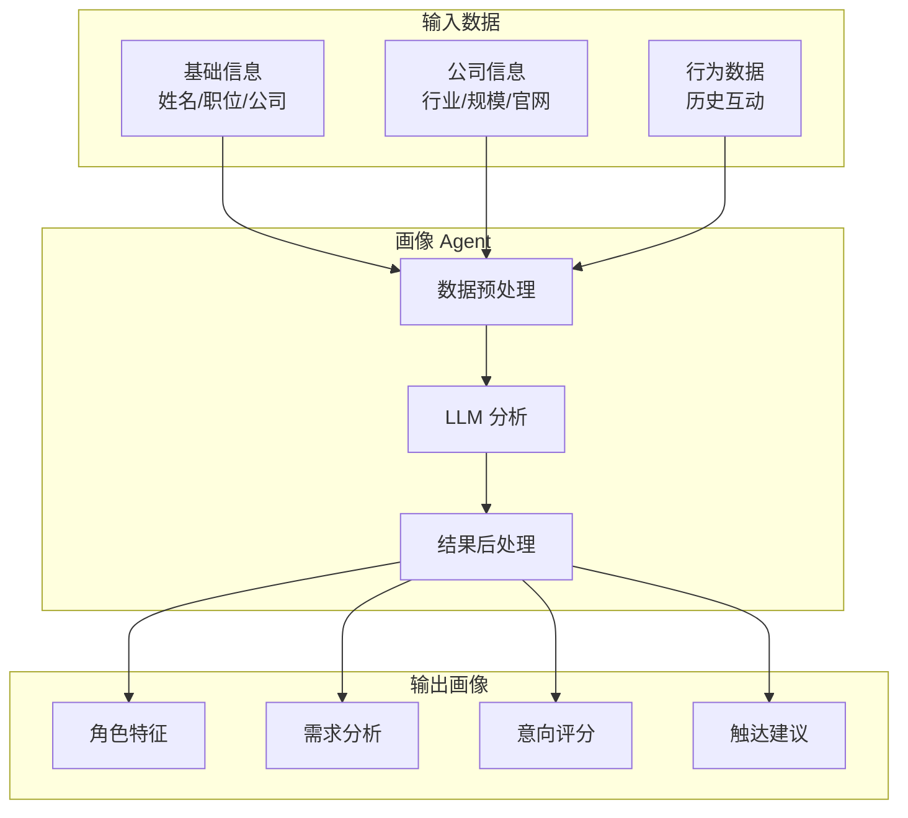
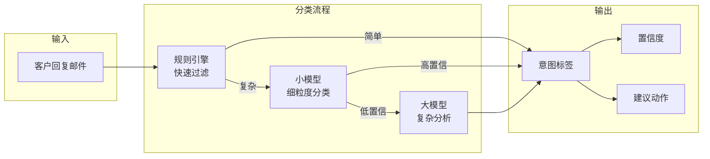
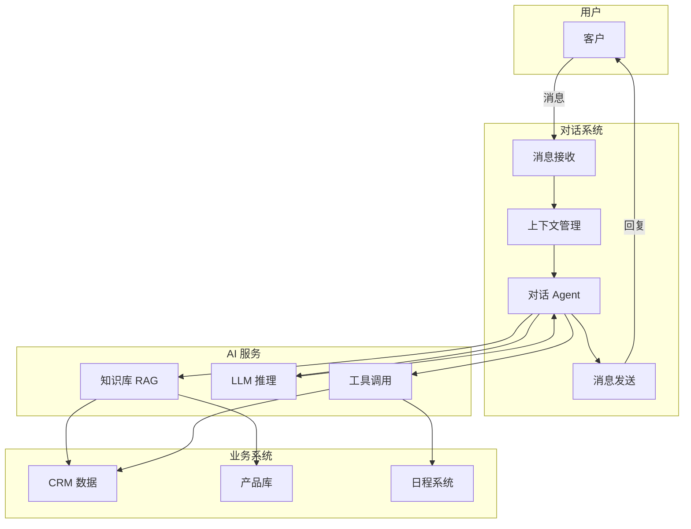
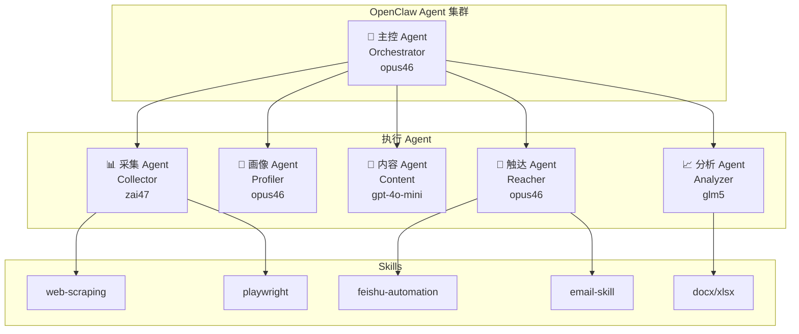

# 拓客Agent - AI/LLM 集成方案

> **文档版本**: V1.0  
> **设计日期**: 2026-03-10  
> **设计人**: 小code (Agent Code)  
> **状态**: 初稿完成

---

## 1. 概述

### 1.1 文档目的

本文档定义拓客Agent系统的 AI/LLM 集成方案，包括：
- LLM 应用场景与实现方案
- 模型选型与成本优化策略
- OpenClaw Agent 编排架构
- 各场景 Prompt 模板设计

### 1.2 AI 在拓客中的价值定位

```
┌────────────────────────────────────────────────────────────────┐
│                    AI 在拓客中的三层价值                         │
├────────────────────────────────────────────────────────────────┤
│                                                                │
│  Level 1: AI 辅助 (AI-Assisted)                                │
│  ├── 邮件内容生成                                               │
│  ├── 客户信息分析                                               │
│  └── 数据清洗建议                                               │
│                                                                │
│  Level 2: AI 自动化 (AI-Automated)                             │
│  ├── 自动线索评分                                               │
│  ├── 自动画像生成                                               │
│  ├── 自动触达序列                                               │
│  └── 自动效果优化                                               │
│                                                                │
│  Level 3: AI Agent 自主 (AI-Agentic)  ← 我们的目标              │
│  ├── 自主理解目标 ("帮我找SaaS公司CTO")                          │
│  ├── 自主决策策略 (采集谁、触达谁、什么时候触达)                  │
│  ├── 自主执行任务 (完整拓客流程无人干预)                         │
│  └── 自主学习优化 (基于反馈持续改进)                             │
│                                                                │
└────────────────────────────────────────────────────────────────┘
```

### 1.3 核心设计原则

| 原则 | 说明 |
|------|------|
| **分层模型** | 大模型负责推理，小模型负责分类，规则引擎负责简单逻辑 |
| **成本可控** | 每次拓客任务的 AI 成本应低于潜在客户价值 |
| **可观测** | 所有 LLM 调用可追踪、可分析、可优化 |
| **安全合规** | 不泄露客户敏感信息，遵守数据保护法规 |

---

## 2. LLM 应用场景

### 2.1 场景总览

| 场景 | AI 层级 | 模型类型 | 调用频率 | 延迟要求 | 成本敏感度 |
|------|---------|----------|----------|----------|-----------|
| **客户画像分析** | Level 2 | 大模型 | 中 | 低 | 中 |
| **话术生成** | Level 2 | 大模型 | 高 | 中 | 高 |
| **邮件模板生成** | Level 2 | 大模型 | 高 | 中 | 高 |
| **意图识别** | Level 2 | 小模型 | 极高 | 高 | 极高 |
| **对话拓客** | Level 3 | 大模型 | 中 | 极高 | 中 |
| **线索评分** | Level 2 | 小模型+规则 | 极高 | 高 | 极高 |
| **内容优化** | Level 2 | 大模型 | 低 | 低 | 低 |
| **报告生成** | Level 2 | 大模型 | 低 | 低 | 低 |

### 2.2 场景一：客户画像分析

#### 业务目标

基于采集到的客户基础信息，AI 自动生成深度客户画像，包括：
- 决策角色分析
- 需求/痛点推断
- 购买意向评分
- 最佳触达策略建议

#### 技术架构



#### 实现方案

```python
# api/services/ai/profiler.py
from typing import Dict
from openai import AsyncOpenAI
import json

class ProfilerAgent:
    """客户画像生成 Agent"""
    
    def __init__(self, model: str = "gpt-4o-mini"):
        self.client = AsyncOpenAI()
        self.model = model
    
    async def generate_profile(
        self, 
        prospect: Dict,
        company_info: Dict = None
    ) -> Dict:
        """生成客户画像"""
        
        # 构建提示
        prompt = self._build_prompt(prospect, company_info)
        
        # 调用 LLM
        response = await self.client.chat.completions.create(
            model=self.model,
            messages=[
                {"role": "system", "content": PROFILER_SYSTEM_PROMPT},
                {"role": "user", "content": prompt}
            ],
            temperature=0.3,  # 较低温度，保证稳定性
            response_format={"type": "json_object"}
        )
        
        # 解析结果
        result = json.loads(response.choices[0].message.content)
        
        # 后处理：验证分数范围
        result = self._validate_scores(result)
        
        return result
    
    def _build_prompt(self, prospect: Dict, company_info: Dict) -> str:
        """构建画像提示"""
        return f"""
请分析以下潜在客户，生成客户画像。

## 客户信息
- 姓名: {prospect.get('name', '未知')}
- 职位: {prospect.get('title', '未知')}
- 公司: {prospect.get('company', '未知')}
- 行业: {prospect.get('industry', '未知')}
- 公司规模: {prospect.get('company_size', '未知')}
- 地区: {prospect.get('region', '未知')}

## 公司补充信息
{json.dumps(company_info, ensure_ascii=False, indent=2) if company_info else '无'}

## 分析要求
1. 角色特征分析：决策权限、关注重点、可能 KPI
2. 需求分析：潜在痛点、购买动机、预期方案
3. 意向评估：购买意向分数(0-100)、参与度预测、优先级(A/B/C)
4. 触达建议：推荐渠道、沟通风格、最佳时机

请以 JSON 格式返回分析结果。
"""

PROFILER_SYSTEM_PROMPT = """你是一位资深的 B2B 销售专家，擅长分析客户画像。

你的分析应该：
1. 基于事实进行合理推断，不编造信息
2. 考虑行业特点和角色特征
3. 给出具体、可操作的建议
4. 对不确定的信息标注置信度

输出必须是合法的 JSON 格式。"""
```

### 2.3 场景二：话术生成

#### 业务目标

根据客户画像和触达场景，自动生成个性化的销售话术，包括：
- 邮件主题/正文
- 电话开场白
- 微信消息
- 跟进话术

#### 话术类型矩阵

| 话术类型 | 场景 | 长度 | 语气 |
|---------|------|------|------|
| **Cold Email** | 首次触达 | 150-200字 | 专业但不生硬 |
| **Follow-up** | 跟进邮件 | 100-150字 | 简洁有礼 |
| **Value-add** | 价值传递 | 200-300字 | 专业+案例 |
| **Break-up** | 结束邮件 | 50-100字 | 友好结束 |
| **电话话术** | 电话沟通 | 30-60秒 | 口语化 |
| **微信话术** | 企微触达 | 50-100字 | 轻松友好 |

#### 实现方案

```python
# api/services/ai/content_generator.py
from typing import Dict, List
from openai import AsyncOpenAI

class ContentGenerator:
    """话术内容生成器"""
    
    # 话术模板配置
    TEMPLATES = {
        "cold_email": {
            "max_length": 200,
            "tone": "professional_friendly",
            "sections": ["hook", "value_prop", "cta"]
        },
        "follow_up": {
            "max_length": 150,
            "tone": "polite_brief",
            "sections": ["reference", "reminder", "cta"]
        },
        "phone_script": {
            "max_length": 60,  # 秒
            "tone": "conversational",
            "sections": ["greeting", "hook", "ask"]
        }
    }
    
    async def generate_email(
        self,
        prospect: Dict,
        profile: Dict,
        email_type: str = "cold_email",
        product_info: Dict = None
    ) -> Dict:
        """生成邮件内容"""
        
        template_config = self.TEMPLATES[email_type]
        
        prompt = self._build_email_prompt(
            prospect, profile, email_type, product_info
        )
        
        response = await self.client.chat.completions.create(
            model="gpt-4o-mini",  # 使用便宜模型
            messages=[
                {"role": "system", "content": EMAIL_WRITER_SYSTEM_PROMPT},
                {"role": "user", "content": prompt}
            ],
            temperature=0.7,  # 较高温度，增加创意
            max_tokens=500
        )
        
        content = response.choices[0].message.content
        
        # 解析主题和正文
        subject, body = self._parse_email(content)
        
        return {
            "subject": subject,
            "body": body,
            "word_count": len(body.split()),
            "model_used": "gpt-4o-mini"
        }
    
    def _build_email_prompt(
        self,
        prospect: Dict,
        profile: Dict,
        email_type: str,
        product_info: Dict
    ) -> str:
        """构建邮件生成提示"""
        
        # 根据邮箱类型选择示例
        examples = FEW_SHOT_EXAMPLES.get(email_type, [])
        examples_text = "\n\n".join([
            f"示例 {i+1}:\n{ex}" 
            for i, ex in enumerate(examples[:2])  # 最多2个示例
        ])
        
        return f"""
请为以下客户撰写一封{email_type}邮件。

## 客户信息
- 姓名: {prospect['name']}
- 职位: {prospect['title']}
- 公司: {prospect['company']}
- 行业: {prospect['industry']}

## 客户画像
- 关注重点: {', '.join(profile.get('focus_areas', []))}
- 潜在痛点: {', '.join(profile.get('pain_points', []))}
- 沟通风格偏好: {profile.get('communication_style', '专业')}

## 产品信息
{json.dumps(product_info, ensure_ascii=False, indent=2) if product_info else '请根据客户痛点自行构思价值主张'}

## 邮件要求
- 类型: {email_type}
- 长度: {self.TEMPLATES[email_type]['max_length']}字以内
- 语气: {self.TEMPLATES[email_type]['tone']}
- 包含清晰的 CTA

## 参考示例
{examples_text}

请按以下格式输出：
Subject: [邮件主题]

[邮件正文]
"""

EMAIL_WRITER_SYSTEM_PROMPT = """你是一位专业的 B2B 销售邮件撰写专家。

你的邮件应该：
1. 开头抓住注意力（使用个性化钩子）
2. 展示对客户痛点的理解
3. 提供具体的价值主张
4. 使用清晰、单一的 CTA
5. 语气专业但友好，避免营销腔调
6. 长度适中，不啰嗦

记住：
- 不要使用"亲爱的客户"这类模板化称呼
- 不要堆砌产品功能
- 不要过度承诺"""
```

### 2.4 场景三：意图识别

#### 业务目标

从客户回复中识别购买意向，自动分类：
- **Positive**: 正向意向（感兴趣、要求演示、询价）
- **Neutral**: 中性（需要更多信息、时间问题）
- **Negative**: 负向（不感兴趣、已有方案）
- **OutOfOffice**: 自动回复
- **Spam**: 垃圾邮件

#### 技术架构



#### 分层分类策略

```python
# api/services/ai/intent_classifier.py
from typing import Dict, Tuple
import re

class IntentClassifier:
    """意图识别器 - 三层架构"""
    
    # Layer 1: 规则引擎（免费、快速）
    RULES = {
        "out_of_office": [
            r"自动回复", r"out of office", r"不在办公室",
            r"vacation", r"度假", r"休假"
        ],
        "spam": [
            r"unsubscribe", r"取消订阅", r"退订",
            r"招聘", r"贷款", r"发票"
        ],
        "positive": [
            r"感兴趣", r"了解.*详情", r"演示", r"报价",
            r"interested", r"demo", r"pricing", r"quote"
        ],
        "negative": [
            r"不感兴趣", r"不需要", r"已有.*方案",
            r"not interested", r"no need", r"unsubscribe"
        ]
    }
    
    async def classify(
        self, 
        email_content: str,
        use_llm: bool = True
    ) -> Dict:
        """分类意图"""
        
        # Layer 1: 规则匹配（极低成本）
        intent, confidence = self._rule_classify(email_content)
        if confidence > 0.9:
            return {
                "intent": intent,
                "confidence": confidence,
                "method": "rule",
                "suggested_action": self._get_action(intent)
            }
        
        # Layer 2: 小模型分类（低成本）
        if use_llm:
            intent, confidence = await self._small_model_classify(
                email_content
            )
            if confidence > 0.8:
                return {
                    "intent": intent,
                    "confidence": confidence,
                    "method": "small_model",
                    "suggested_action": self._get_action(intent)
                }
            
            # Layer 3: 大模型分析（中等成本）
            intent, confidence, analysis = await self._llm_classify(
                email_content
            )
            return {
                "intent": intent,
                "confidence": confidence,
                "method": "llm",
                "analysis": analysis,
                "suggested_action": self._get_action(intent)
            }
        
        return {
            "intent": intent,
            "confidence": confidence,
            "method": "rule",
            "suggested_action": self._get_action(intent)
        }
    
    def _rule_classify(self, content: str) -> Tuple[str, float]:
        """规则分类"""
        content_lower = content.lower()
        
        for intent, patterns in self.RULES.items():
            for pattern in patterns:
                if re.search(pattern, content_lower, re.IGNORECASE):
                    return intent, 0.95
        
        return "neutral", 0.5
    
    async def _small_model_classify(
        self, 
        content: str
    ) -> Tuple[str, float]:
        """小模型分类 - 使用 GPT-4o-mini"""
        
        response = await self.client.chat.completions.create(
            model="gpt-4o-mini",
            messages=[
                {"role": "system", "content": INTENT_CLASSIFIER_SYSTEM},
                {"role": "user", "content": f"分类以下邮件的意图:\n\n{content[:500]}"}
            ],
            temperature=0.1,
            max_tokens=50
        )
        
        # 解析结果
        result = response.choices[0].message.content.strip()
        # 格式: "positive, 0.85"
        parts = result.split(",")
        intent = parts[0].strip()
        confidence = float(parts[1].strip()) if len(parts) > 1 else 0.7
        
        return intent, confidence
    
    def _get_action(self, intent: str) -> str:
        """获取建议动作"""
        actions = {
            "positive": "立即跟进，安排演示或提供报价",
            "neutral": "发送更多材料，保持联系",
            "negative": "标记为不感兴趣，停止触达",
            "out_of_office": "延迟跟进，记录休假结束时间",
            "spam": "标记为垃圾邮件，从列表移除"
        }
        return actions.get(intent, "人工审核")

INTENT_CLASSIFIER_SYSTEM = """你是一个邮件意图分类器。

根据邮件内容，判断发件人的意图，并给出置信度。

可能的意图：
- positive: 正向意向（感兴趣、要求演示、询价）
- neutral: 中性（需要更多信息、时间问题）
- negative: 负向（不感兴趣、已有方案）

输出格式: 意图, 置信度
例如: positive, 0.85"""
```

### 2.5 场景四：对话拓客

#### 业务目标

实现 AI 自主对话拓客，适用于：
- 微信/企微自动回复
- 邮件回复生成
- 电话对话辅助

#### 对话拓客架构



#### 对话 Agent 实现

```python
# api/services/ai/conversation_agent.py
from typing import Dict, List, Optional
from openai import AsyncOpenAI
import json

class ConversationAgent:
    """对话拓客 Agent"""
    
    def __init__(self):
        self.client = AsyncOpenAI()
        self.conversation_history: List[Dict] = []
    
    async def reply(
        self,
        user_message: str,
        context: Dict,
        prospect: Dict,
        tools: List[Dict] = None
    ) -> Dict:
        """生成对话回复"""
        
        # 构建消息历史
        messages = self._build_messages(user_message, context, prospect)
        
        # 调用 LLM（支持工具调用）
        response = await self.client.chat.completions.create(
            model="gpt-4o",  # 对话需要更强模型
            messages=messages,
            tools=tools,
            tool_choice="auto",
            temperature=0.7
        )
        
        # 处理工具调用
        if response.choices[0].message.tool_calls:
            return await self._handle_tool_calls(
                response, messages, tools
            )
        
        # 返回文本回复
        return {
            "type": "text",
            "content": response.choices[0].message.content,
            "should_continue": True
        }
    
    def _build_messages(
        self,
        user_message: str,
        context: Dict,
        prospect: Dict
    ) -> List[Dict]:
        """构建消息历史"""
        
        # 系统提示
        system_prompt = CONVERSATION_SYSTEM_PROMPT.format(
            company=prospect.get('company', '未知'),
            name=prospect.get('name', '客户'),
            title=prospect.get('title', ''),
            industry=prospect.get('industry', '')
        )
        
        messages = [
            {"role": "system", "content": system_prompt}
        ]
        
        # 添加历史对话
        messages.extend(self.conversation_history[-10:])  # 保留最近10轮
        
        # 添加当前消息
        messages.append({"role": "user", "content": user_message})
        
        return messages

CONVERSATION_SYSTEM_PROMPT = """你是 {company} 的销售代表 AI 助手。

你正在与 {name}（{title}）进行沟通。

## 你的目标
1. 了解客户需求
2. 展示产品价值
3. 推动下一步行动（演示、试用、报价）

## 沟通原则
- 友好专业，不急不躁
- 先倾听，后推荐
- 针对客户行业({industry})提供具体案例
- 适时推动下一步

## 可用工具
- check_availability: 查询演示时间
- send_material: 发送产品资料
- create_quote: 生成报价

当客户同意演示或询价时，主动使用相应工具。"""

# 工具定义
CONVERSATION_TOOLS = [
    {
        "type": "function",
        "function": {
            "name": "check_availability",
            "description": "查询可用的演示时间",
            "parameters": {
                "type": "object",
                "properties": {
                    "date": {
                        "type": "string",
                        "description": "日期，格式 YYYY-MM-DD"
                    }
                },
                "required": ["date"]
            }
        }
    },
    {
        "type": "function",
        "function": {
            "name": "send_material",
            "description": "发送产品资料到客户邮箱",
            "parameters": {
                "type": "object",
                "properties": {
                    "material_type": {
                        "type": "string",
                        "enum": ["whitepaper", "case_study", "product_sheet"]
                    }
                },
                "required": ["material_type"]
            }
        }
    },
    {
        "type": "function",
        "function": {
            "name": "create_quote",
            "description": "生成产品报价",
            "parameters": {
                "type": "object",
                "properties": {
                    "product_edition": {
                        "type": "string",
                        "enum": ["basic", "pro", "enterprise"]
                    },
                    "seats": {
                        "type": "integer",
                        "description": "用户数"
                    }
                },
                "required": ["product_edition", "seats"]
            }
        }
    }
]
```

---

## 3. 模型选型与成本优化

### 3.1 模型分层策略

```
┌─────────────────────────────────────────────────────────────────┐
│                      模型分层架构                                │
├─────────────────────────────────────────────────────────────────┤
│                                                                 │
│  Layer 0: 规则引擎 (免费)                                        │
│  ├── 正则匹配                                                    │
│  ├── 关键词过滤                                                  │
│  └── 简单条件判断                                                │
│                                                                 │
│  Layer 1: 小模型 (极低成本)                                      │
│  ├── GPT-4o-mini ($0.15/1M input)                              │
│  ├── DeepSeek V3 ($0.1/1M input)                               │
│  ├── GLM-4-Flash (免费)                                         │
│  └── 本地小模型 (7B以下，免费)                                   │
│                                                                 │
│  Layer 2: 中型模型 (中等成本)                                    │
│  ├── Claude 3.5 Haiku ($0.25/1M input)                         │
│  ├── GPT-4o ($2.5/1M input)                                    │
│  └── GLM-4 ($0.5/1M input)                                     │
│                                                                 │
│  Layer 3: 大模型 (较高成本)                                      │
│  ├── Claude 3.5 Sonnet ($3/1M input)                           │
│  ├── Claude Opus 4 ($15/1M input)                              │
│  └── GPT-4 Turbo ($10/1M input)                                │
│                                                                 │
└─────────────────────────────────────────────────────────────────┘
```

### 3.2 场景-模型映射

| 场景 | 首选模型 | 备选模型 | 理由 |
|------|---------|---------|------|
| **客户画像** | GPT-4o-mini | GLM-4-Flash | 需要推理但不需要顶级能力 |
| **邮件生成** | GPT-4o-mini | DeepSeek V3 | 高频调用，成本敏感 |
| **意图识别** | GPT-4o-mini | 规则引擎 | 极高频，成本极敏感 |
| **对话拓客** | GPT-4o | Claude 3.5 Sonnet | 需要强推理和上下文理解 |
| **复杂分析** | Claude 3.5 Sonnet | GPT-4o | 需要顶级推理能力 |
| **报告生成** | GLM-4 | GPT-4o-mini | 低频，中文优化 |

### 3.3 成本估算模型

#### 单次拓客任务成本

```yaml
# 假设：一次拓客活动采集 100 个线索，触达 100 人

阶段1: 线索采集
  - 无 LLM 调用（爬虫 + 规则）
  - 成本: $0

阶段2: 客户画像 (100次)
  - 模型: GPT-4o-mini
  - 输入: ~500 tokens × 100 = 50K tokens
  - 输出: ~300 tokens × 100 = 30K tokens
  - 成本: 50K × $0.15/1M + 30K × $0.6/1M = $0.025

阶段3: 邮件生成 (100次)
  - 模型: GPT-4o-mini
  - 输入: ~400 tokens × 100 = 40K tokens
  - 输出: ~200 tokens × 100 = 20K tokens
  - 成本: 40K × $0.15/1M + 20K × $0.6/1M = $0.018

阶段4: 意图识别 (假设 20% 回复率 = 20次)
  - 模型: GPT-4o-mini (80% 命中规则引擎)
  - 实际 LLM 调用: 4 次
  - 输入: ~200 tokens × 4 = 800 tokens
  - 输出: ~20 tokens × 4 = 80 tokens
  - 成本: 可忽略

阶段5: 对话回复 (假设 10% 深度对话 = 10人 × 5轮)
  - 模型: GPT-4o
  - 调用: 50 次
  - 输入: ~1000 tokens × 50 = 50K tokens
  - 输出: ~200 tokens × 50 = 10K tokens
  - 成本: 50K × $2.5/1M + 10K × $10/1M = $0.225

总计: $0.025 + $0.018 + $0.225 ≈ $0.27
人均成本: $0.0027 (约 ¥0.02)
```

#### 月度成本预测

```yaml
# 假设：月度 10,000 次拓客触达

画像生成: 10,000 × $0.00025 = $2.5
邮件生成: 10,000 × $0.00018 = $1.8
对话回复: 1,000 × $0.0045 = $4.5  # 10% 深度对话

总计: $8.8/月 (约 ¥64/月)

# 如果使用更便宜的模型 (DeepSeek V3)
总计: ~$3/月 (约 ¥22/月)

# 如果使用本地模型 (GLM-4-Flash 免费)
总计: $0 (需自建推理服务)
```

### 3.4 成本优化策略

```python
# api/services/ai/cost_optimizer.py
from typing import Dict
import hashlib

class CostOptimizer:
    """AI 成本优化器"""
    
    def __init__(self):
        self.cache = {}  # 简单缓存，生产环境用 Redis
        self.request_count = {}
    
    async def smart_call(
        self,
        prompt: str,
        task_type: str,
        force_model: str = None
    ) -> str:
        """智能调用 - 自动选择最优模型"""
        
        # 1. 检查缓存
        cache_key = self._hash_prompt(prompt, task_type)
        if cache_key in self.cache:
            return self.cache[cache_key]
        
        # 2. 选择模型
        model = force_model or self._select_model(task_type, prompt)
        
        # 3. 调用 LLM
        result = await self._call_llm(model, prompt)
        
        # 4. 缓存结果（可复用的内容）
        if task_type in ["profile", "email_template"]:
            self.cache[cache_key] = result
        
        return result
    
    def _select_model(self, task_type: str, prompt: str) -> str:
        """选择最优模型"""
        
        # 规则 1: 简单任务用规则引擎
        if self._can_use_rules(task_type, prompt):
            return "rules"
        
        # 规则 2: 根据任务类型选择
        model_map = {
            "profile": "gpt-4o-mini",
            "email": "gpt-4o-mini",
            "intent": "gpt-4o-mini",
            "conversation": "gpt-4o",
            "analysis": "claude-3.5-sonnet"
        }
        
        return model_map.get(task_type, "gpt-4o-mini")
    
    def _can_use_rules(self, task_type: str, prompt: str) -> bool:
        """判断是否可以使用规则引擎"""
        if task_type == "intent":
            # 简单的意图识别
            keywords = {
                "positive": ["感兴趣", "演示", "报价"],
                "negative": ["不需要", "不感兴趣"],
                "ooo": ["自动回复", "vacation"]
            }
            for intent, words in keywords.items():
                if any(w in prompt for w in words):
                    return True
        return False
    
    def _hash_prompt(self, prompt: str, task_type: str) -> str:
        """生成缓存 key"""
        return hashlib.md5(
            f"{task_type}:{prompt}".encode()
        ).hexdigest()
```

### 3.5 Token 优化技巧

```python
# Token 优化策略

# 1. 输入压缩
def compress_context(context: Dict) -> str:
    """压缩上下文，减少 token"""
    # 只保留关键字段
    key_fields = ["name", "company", "title", "industry"]
    return " | ".join([
        f"{k}: {context.get(k, 'N/A')}" 
        for k in key_fields
    ])

# 2. 输出限制
RESPONSE_LIMITS = {
    "profile": 500,   # 画像输出限制
    "email": 300,     # 邮件正文限制
    "intent": 50,     # 意图标签限制
    "reply": 150      # 对话回复限制
}

# 3. 批量处理
async def batch_process(items: List, task_type: str):
    """批量处理，减少 API 调用"""
    # 将多个请求合并为一个
    if task_type == "intent":
        # 意图识别可以批量
        batch_prompt = "\n---\n".join([
            f"邮件 {i+1}: {item}" 
            for i, item in enumerate(items)
        ])
        # ... 调用 LLM

# 4. 流式输出（用户体验 + 首字延迟）
async def stream_generate(prompt: str):
    """流式生成"""
    async for chunk in client.chat.completions.create(
        model="gpt-4o-mini",
        messages=[{"role": "user", "content": prompt}],
        stream=True
    ):
        yield chunk.choices[0].delta.content
```

---

## 4. OpenClaw Agent 编排

### 4.1 Agent 架构设计



### 4.2 Agent 配置

```json5
// ~/.openclaw/openclaw.json
{
  "agents": {
    "defaults": {
      "model": {
        "primary": "xingsuancode/claude-opus-4-6",
        "fallbacks": ["zai/glm-5", "moonshot/kimi-k2.5"]
      },
      "subagents": {
        "model": "zai/glm-4.7",
        "maxConcurrent": 8,
        "runTimeoutSeconds": 600
      }
    },
    "list": [
      {
        "agentId": "tuoke-orchestrator",
        "name": "拓客主控",
        "description": "拓客流程主控 Agent，理解用户目标，分发任务，协调各执行 Agent",
        "model": {
          "primary": "xingsuancode/claude-opus-4-6",
          "fallbacks": ["zai/glm-5"]
        },
        "skills": ["tuoke-skill"],
        "systemPrompt": ORCHESTRATOR_PROMPT
      },
      {
        "agentId": "tuoke-collector",
        "name": "线索采集",
        "description": "从多个数据源采集潜在客户信息",
        "model": {
          "primary": "zai/glm-4.7"
        },
        "skills": ["web-scraping-automation", "playwright-automation"],
        "systemPrompt": COLLECTOR_PROMPT
      },
      {
        "agentId": "tuoke-profiler",
        "name": "客户画像",
        "description": "分析客户数据，生成客户画像和意向预测",
        "model": {
          "primary": "xingsuancode/claude-opus-4-6",
          "fallbacks": ["zai/glm-5"]
        },
        "skills": ["data-analysis"],
        "systemPrompt": PROFILER_PROMPT
      },
      {
        "agentId": "tuoke-content",
        "name": "内容生成",
        "description": "生成个性化邮件、话术等触达内容",
        "model": {
          "primary": "zai/glm-4.7",
          "fallbacks": ["xingjiabiapi/gemini-3-pro-preview"]
        },
        "skills": ["seo-content-writing"],
        "systemPrompt": CONTENT_PROMPT
      },
      {
        "agentId": "tuoke-reacher",
        "name": "智能触达",
        "description": "执行多渠道触达（邮件、微信、电话）",
        "model": {
          "primary": "xingsuancode/claude-opus-4-6"
        },
        "skills": ["email-automation", "feishu-automation"],
        "systemPrompt": REACHER_PROMPT
      },
      {
        "agentId": "tuoke-analyzer",
        "name": "效果分析",
        "description": "分析触达效果，生成优化报告",
        "model": {
          "primary": "zai/glm-5"
        },
        "skills": ["xlsx", "docx", "data-analysis"],
        "systemPrompt": ANALYZER_PROMPT
      }
    ]
  }
}
```

### 4.3 Agent 编排流程

```python
# api/services/agent/tuoke_orchestrator.py
from typing import Dict, List
import httpx

class TuokeOrchestrator:
    """拓客主控编排器"""
    
    def __init__(self, openclaw_url: str):
        self.openclaw_url = openclaw_url
        self.client = httpx.AsyncClient()
    
    async def run_campaign(
        self, 
        user_goal: str,
        campaign_config: Dict
    ) -> Dict:
        """执行完整的拓客活动"""
        
        campaign_id = campaign_config["campaign_id"]
        
        # === Phase 1: 目标理解 ===
        # 主控 Agent 理解用户目标，生成采集策略
        orchestrator = await self._spawn_agent(
            agent_type="tuoke-orchestrator",
            task=f"""
用户目标: {user_goal}

请分析用户目标，生成采集策略：
1. 目标行业
2. 目标公司规模
3. 目标职位
4. 推荐数据源
5. 预计线索数量

返回 JSON 格式。
""",
            label=f"orch-{campaign_id}"
        )
        
        strategy = await self._wait_result(orchestrator)
        
        # === Phase 2: 线索采集 ===
        collector = await self._spawn_agent(
            agent_type="tuoke-collector",
            task=f"""
根据以下策略采集线索：

采集策略:
{strategy}

要求：
1. 从企查查、天眼查采集
2. 数据清洗去重
3. 验证邮箱格式
4. 保存到数据库

返回采集到的线索数量和示例。
""",
            label=f"collect-{campaign_id}"
        )
        
        collect_result = await self._wait_result(collector)
        prospect_ids = collect_result["prospect_ids"]
        
        # === Phase 3: 批量画像 (并行) ===
        profile_tasks = []
        for pid in prospect_ids[:50]:  # 限制并发
            task = await self._spawn_agent(
                agent_type="tuoke-profiler",
                task=f"为线索 {pid} 生成客户画像",
                label=f"profile-{pid}"
            )
            profile_tasks.append(task)
        
        profiles = await self._wait_all(profile_tasks)
        
        # === Phase 4: 内容生成 + 触达 (并行) ===
        reach_tasks = []
        for profile in profiles:
            # 4a. 生成邮件内容
            content_task = await self._spawn_agent(
                agent_type="tuoke-content",
                task=f"为 {profile['name']} 生成冷启动邮件",
                label=f"content-{profile['id']}"
            )
            content = await self._wait_result(content_task)
            
            # 4b. 执行触达
            reach_task = await self._spawn_agent(
                agent_type="tuoke-reacher",
                task=f"""
发送邮件到 {profile['email']}:

主题: {content['subject']}
正文: {content['body']}

发送后记录触达结果。
""",
                label=f"reach-{profile['id']}"
            )
            reach_tasks.append(reach_task)
        
        reach_results = await self._wait_all(reach_tasks)
        
        # === Phase 5: 效果分析 ===
        analyzer = await self._spawn_agent(
            agent_type="tuoke-analyzer",
            task=f"""
分析拓客活动 {campaign_id} 的效果：

采集数量: {len(prospect_ids)}
画像数量: {len(profiles)}
触达数量: {len(reach_results)}

生成效果报告，包括：
1. 转化漏斗
2. 问题分析
3. 优化建议
""",
            label=f"analyze-{campaign_id}"
        )
        
        report = await self._wait_result(analyzer)
        
        return {
            "campaign_id": campaign_id,
            "prospects_collected": len(prospect_ids),
            "profiles_generated": len(profiles),
            "reaches_sent": len(reach_results),
            "report": report
        }
```

### 4.4 Skill 设计

#### tuoke-skill 主 Skill

```markdown
# ~/.openclaw/skills/tuoke-skill/SKILL.md

# tuoke-skill

拓客智能体核心 Skill，封装拓客业务逻辑。

## 触发场景
- "拓客" "采集客户" "获客"
- "找客户" "客户开发"
- "销售线索" "商机挖掘"

## 能力模块

### 1. 目标理解 (Goal Understanding)
解析用户自然语言描述的目标客户画像：
- 输入: "帮我找北京 SaaS 公司的 CTO"
- 输出: JSON 格式的采集条件

### 2. 线索采集 (Lead Collection)
从多个数据源采集潜在客户：
- 数据源: 企查查、天眼查、LinkedIn、官网
- 处理: 清洗、去重、验证

### 3. 客户画像 (Customer Profiling)
AI 分析生成客户画像：
- 角色分析
- 需求推断
- 意向评分
- 触达策略

### 4. 智能触达 (Smart Outreach)
多渠道个性化触达：
- 邮件: Cold Email + Follow-up 序列
- 微信: 企微消息
- 电话: AI 话术辅助

### 5. 效果优化 (Performance Optimization)
分析效果，持续优化：
- A/B 测试
- 内容优化
- 时机优化

## 工作流

1. 理解目标 → 2. 采集线索 → 3. 生成画像 → 4. 内容生成 → 5. 执行触达 → 6. 效果分析 → 7. 优化迭代

## 约束

- 遵守《个人信息保护法》
- 遵守《反垃圾邮件法》
- 尊重用户退订意愿
- 数据本地化存储

## 依赖 Skills

- web-scraping-automation
- playwright-automation
- feishu-automation
- email-automation
```

#### email-skill 子 Skill

```markdown
# ~/.openclaw/skills/email-skill/SKILL.md

# email-skill

邮件触达专用 Skill，封装邮件发送和追踪逻辑。

## 触发场景
- "发送邮件" "邮件触达"
- "冷启动邮件" "跟进邮件"

## 能力

### 1. 邮件发送
- 支持: SendGrid, Resend, SMTP
- 功能: 模板渲染、个性化、追踪像素

### 2. 追踪
- 打开追踪
- 点击追踪
- 退回检测

### 3. 序列管理
- 多步骤邮件序列
- 条件触发（未打开则跟进）
- 时间间隔控制

## 配置

```yaml
email:
  provider: sendgrid
  from_address: "sales@example.com"
  from_name: "销售团队"
  tracking:
    opens: true
    clicks: true
  rate_limit:
    per_hour: 100
    per_day: 500
```

## API

```python
# 发送单封邮件
send_email(
    to="prospect@example.com",
    subject="...",
    body="...",
    track_opens=True
)

# 启动邮件序列
start_sequence(
    prospect_id="xxx",
    sequence_type="cold_email",
    steps=[
        {"day": 0, "type": "intro"},
        {"day": 3, "type": "follow_up", "condition": "not_opened"},
        {"day": 7, "type": "break_up", "condition": "not_replied"}
    ]
)
```
```

---

## 5. Prompt 模板库

### 5.1 客户画像 Prompt

#### System Prompt

```markdown
# PROFILER_SYSTEM_PROMPT

你是一位资深的 B2B 销售专家，擅长分析客户画像。你的任务是根据有限的信息推断客户的特征、需求和购买意向。

## 分析维度

### 1. 角色特征
- 决策权限: 高/中/低
  - 高: C级、VP、总监（有预算决策权）
  - 中: 经理（有建议权，需上报）
  - 低: 专员（执行者，无决策权）
- 关注重点: 技术/业务/成本/效率/合规
- 可能 KPI: 基于职位推断可能的考核指标

### 2. 需求分析
- 潜在痛点: 3-5个具体的痛点
- 购买动机: 为什么可能购买
- 预期方案: 期望什么样的解决方案

### 3. 意向评估
- 购买意向分数: 0-100
- 参与度预测: 高/中/低
- 优先级: A/B/C

### 4. 触达建议
- 推荐渠道: email/wechat/phone
- 沟通风格: formal/casual/technical
- 最佳触达时机

## 分析原则

1. 基于事实合理推断，不编造信息
2. 对不确定的信息标注置信度
3. 考虑行业特点和公司规模
4. 输出具体可操作的建议

## 输出格式

返回 JSON 格式，包含以上四个维度的分析结果。
```

#### User Prompt 模板

```markdown
请分析以下潜在客户，生成客户画像。

## 客户信息
- 姓名: {name}
- 职位: {title}
- 公司: {company}
- 行业: {industry}
- 公司规模: {company_size}
- 地区: {region}
- 公司官网: {website}

## 公司补充信息
{company_info}

## 历史互动（如有）
{interaction_history}

请按以下 JSON 格式返回：

```json
{
  "role_analysis": {
    "decision_level": "high/medium/low",
    "focus_areas": ["...", "..."],
    "possible_kpis": ["...", "..."]
  },
  "need_analysis": {
    "pain_points": ["...", "...", "..."],
    "buying_motivations": ["...", "..."],
    "expected_solutions": ["...", "..."]
  },
  "intent_assessment": {
    "buying_signal_score": 0-100,
    "engagement_prediction": "high/medium/low",
    "priority_level": "A/B/C",
    "confidence": 0.0-1.0
  },
  "reach_suggestions": {
    "preferred_channel": "email/wechat/phone",
    "communication_style": "formal/casual/technical",
    "best_reach_time": "morning/afternoon/evening",
    "talking_points": ["...", "..."]
  }
}
```
```

### 5.2 邮件生成 Prompt

#### System Prompt

```markdown
# EMAIL_WRITER_SYSTEM_PROMPT

你是一位专业的 B2B 销售邮件撰写专家。你的任务是撰写高转化率的销售邮件。

## 撰写原则

### 结构
1. **钩子 (Hook)**: 个性化开头，抓住注意力
2. **价值主张 (Value Prop)**: 展示具体价值，非产品功能
3. **CTA**: 清晰、单一的下一步行动

### 语气
- 专业但不生硬
- 友好但不随意
- 自信但不傲慢

### 禁忌
- ❌ "亲爱的客户" "尊敬的先生/女士"
- ❌ 堆砌产品功能
- ❌ 过度承诺
- ❌ 营销腔调
- ❌ 长篇大论

### 最佳实践
- ✅ 使用收件人姓名
- ✅ 提及具体行业洞察
- ✅ 展示对痛点的理解
- ✅ 提供社会证明
- ✅ CTA 明确（如"回复 1 预约演示"）
```

#### Cold Email 模板

```markdown
# COLD_EMAIL_TEMPLATE

请为以下客户撰写一封冷启动邮件（Cold Email）。

## 客户信息
- 姓名: {name}
- 职位: {title}
- 公司: {company}
- 行业: {industry}

## 客户画像洞察
- 关注重点: {focus_areas}
- 潜在痛点: {pain_points}
- 沟通风格偏好: {communication_style}

## 我们的产品
{product_description}

## 要求
- 长度: 150-200字
- 语气: 专业但友好
- 个性化程度: 高
- CTA: 邀请 15 分钟电话/演示

## 参考示例

### 示例 1: SaaS 行业 CTO
Subject: {company} 的技术架构升级方案

{name}，你好！

注意到 {company} 近期在 {某项业务} 上有不少动作。作为 {industry} 领域的 {title}，我想你可能也在关注 {痛点相关话题}。

我们帮助过 {类似公司} 通过 {方案} 实现了 {具体成果}，比如：
- 某指标提升 X%
- 成本降低 Y%
- 效率提升 Z%

如果你正在思考 {相关话题}，我可以分享一些行业洞察。

有兴趣聊聊吗？回复 1，我发你一份相关案例。

祝好，
{sender_name}
{sender_title}

---

### 示例 2: 制造业 IT 总监
Subject: 关于 {company} 数字化转型的一点想法

{name} 总监，你好！

最近在研究 {industry} 的数字化转型，发现 {company} 在这方面很有前瞻性。

我注意到很多制造企业在 {痛点领域} 面临类似挑战：
- 挑战 1
- 挑战 2

我们最近帮助 {客户} 解决了这个问题，效果不错。如果你感兴趣，我可以安排一次 15 分钟的简短交流。

回复"方便"告诉我你的时间偏好。

{sender_name}
```

#### Follow-up 邮件模板

```markdown
# FOLLOW_UP_EMAIL_TEMPLATE

请撰写一封跟进邮件（Follow-up Email）。

## 背景
- 首次触达时间: {first_reach_date}
- 客户是否打开: {opened}
- 客户是否点击: {clicked}
- 客户是否回复: {replied}

## 首次邮件主题
{original_subject}

## 客户信息
- 姓名: {name}
- 公司: {company}

## 要求
- 长度: 100-150字
- 语气: 友好但不过于热情
- 不要重复首次邮件内容
- CTA: 重新建立连接

## 参考示例

### 未打开的跟进
Subject: RE: {original_subject}

{name}，我猜你的收件箱可能很满 :)

只是想确保你收到了我之前的邮件。如果你正在思考 {痛点相关话题}，我有几个想法可能对你有帮助。

需要我把资料发你看看吗？

{sender_name}

---

### 打开但未回复的跟进
Subject: 关于 {company} 的 {相关话题}

{name}，感谢你查看我之前的邮件。

我想你可能是在考虑 {客户可能的顾虑}。如果你愿意分享，我很想了解你们的想法，看看是否有合作机会。

或者，如果现在不是好时机，我们可以几个月后再聊？

{sender_name}
```

### 5.3 意图识别 Prompt

```markdown
# INTENT_CLASSIFICATION_PROMPT

请分析以下客户回复邮件，判断客户意图。

## 邮件内容
{email_content}

## 客户背景
- 姓名: {name}
- 公司: {company}
- 上次触达: {last_reach}

## 意图分类

### Positive (正向)
- 表达兴趣
- 要求演示
- 询问价格
- 请求更多信息
- 同意下一步

### Neutral (中性)
- 需要时间考虑
- 需要和团队讨论
- 询问细节问题
- 没有明确态度

### Negative (负向)
- 明确不感兴趣
- 已有类似方案
- 没有预算
- 要求不再联系

### Other
- OutOfOffice: 自动回复
- Spam: 垃圾邮件
- Question: 提问（需人工）

## 输出格式

```json
{
  "intent": "positive/neutral/negative/other",
  "subtype": "interested/demo_request/pricing/etc.",
  "confidence": 0.0-1.0,
  "key_phrases": ["...", "..."],
  "suggested_action": "...",
  "suggested_reply": "..."
}
```

## 参考示例

### Positive 示例
邮件: "Hi, thanks for reaching out. I'd love to see a demo. How about next Tuesday?"
输出:
```json
{
  "intent": "positive",
  "subtype": "demo_request",
  "confidence": 0.95,
  "key_phrases": ["love to see a demo", "next Tuesday"],
  "suggested_action": "安排演示",
  "suggested_reply": "Great! Tuesday works. I'll send a calendar invite..."
}
```

### Neutral 示例
邮件: "看起来不错，但我需要和团队讨论一下。下个月再联系？"
输出:
```json
{
  "intent": "neutral",
  "subtype": "need_discussion",
  "confidence": 0.85,
  "key_phrases": ["和团队讨论", "下个月"],
  "suggested_action": "标记为待跟进，设置下月提醒",
  "suggested_reply": "没问题！我下个月初再联系你..."
}
```

### Negative 示例
邮件: "谢谢，但我们已经有类似的方案了。"
输出:
```json
{
  "intent": "negative",
  "subtype": "have_alternative",
  "confidence": 0.90,
  "key_phrases": ["已经有类似的方案"],
  "suggested_action": "标记为不感兴趣，停止触达",
  "suggested_reply": "了解！如果未来有需要，随时联系..."
}
```
```

### 5.4 对话拓客 Prompt

```markdown
# CONVERSATION_AGENT_PROMPT

你是 {company_name} 的销售代表 AI 助手，正在通过 {channel} 与潜在客户 {prospect_name} 进行沟通。

## 你的身份
- 公司: {company_name}
- 产品: {product_name}
- 职位: 销售顾问

## 客户信息
- 姓名: {prospect_name}
- 职位: {prospect_title}
- 公司: {prospect_company}
- 行业: {prospect_industry}
- 画像: {prospect_profile_summary}

## 对话历史
{conversation_history}

## 你的目标
1. 了解客户具体需求
2. 展示产品价值（与客户痛点关联）
3. 推动下一步行动（演示、试用、报价）

## 沟通风格
- {communication_style}
- 友好专业，不急不躁
- 先倾听，后推荐
- 适时推动下一步

## 行业知识 ({prospect_industry})
{industry_knowledge}

## 产品知识
{product_knowledge}

## 可用工具
- check_availability(date): 查询演示可用时间
- send_material(type): 发送产品资料 (whitepaper/case_study/product_sheet)
- create_quote(edition, seats): 生成报价

## 回复原则
1. 简洁明了（{channel} 适合的长度）
2. 回答问题，同时推动对话
3. 遇到无法回答的问题，诚实说明
4. 识别购买信号，主动提出下一步
5. 识别拒绝信号，优雅收尾

## 禁止行为
- ❌ 过度推销
- ❌ 虚假承诺
- ❌ 泄露敏感信息
- ❌ 粘贴式回复
```

---

## 6. 可观测性与优化

### 6.1 LLM 调用追踪

```python
# api/services/ai/tracing.py
from langfuse import Langfuse
from datetime import datetime

class AITracer:
    """AI 调用追踪器"""
    
    def __init__(self):
        self.langfuse = Langfuse()
    
    async def trace_call(
        self,
        task_type: str,
        model: str,
        input_tokens: int,
        output_tokens: int,
        latency_ms: int,
        cost: float,
        metadata: Dict = None
    ):
        """记录 LLM 调用"""
        
        trace = self.langfuse.trace(
            name=f"llm_call_{task_type}",
            metadata={
                "model": model,
                "input_tokens": input_tokens,
                "output_tokens": output_tokens,
                "latency_ms": latency_ms,
                "cost": cost,
                "timestamp": datetime.now().isoformat(),
                **(metadata or {})
            }
        )
        
        # 记录到数据库
        await self._save_to_db(trace)
```

### 6.2 效果指标

```yaml
AI 效果指标:
  # 成本指标
  - llm_total_cost_dollars      # 总成本 ($)
  - llm_cost_per_prospect       # 单线索成本
  - llm_cost_per_reach          # 单触达成本
  - llm_cost_per_conversion     # 单转化成本

  # 质量指标
  - profile_quality_score       # 画像质量分
  - email_open_rate             # 邮件打开率
  - email_reply_rate            # 邮件回复率
  - intent_accuracy             # 意图识别准确率
  - conversation_success_rate   # 对话成功率

  # 性能指标
  - llm_latency_p50             # 延迟 P50 (ms)
  - llm_latency_p95             # 延迟 P95 (ms)
  - llm_error_rate              # 错误率
  - llm_fallback_rate           # Fallback 率
```

### 6.3 持续优化

```python
# api/services/ai/optimizer.py

class AIOptimizer:
    """AI 效果优化器"""
    
    async def optimize_prompts(self):
        """基于反馈优化 Prompt"""
        
        # 1. 收集低分样本
        low_score_samples = await self._collect_low_score_samples()
        
        # 2. 分析问题
        analysis = await self._analyze_failures(low_score_samples)
        
        # 3. 生成优化建议
        suggestions = await self._generate_suggestions(analysis)
        
        return suggestions
    
    async def ab_test_prompt(
        self,
        prompt_a: str,
        prompt_b: str,
        test_size: int = 100
    ):
        """A/B 测试 Prompt"""
        
        results = {
            "a": {"opens": 0, "replies": 0},
            "b": {"opens": 0, "replies": 0}
        }
        
        # 随机分配测试
        # ... 实现略
        
        return {
            "winner": "a" if results["a"]["replies"] > results["b"]["replies"] else "b",
            "improvement": abs(results["a"]["replies"] - results["b"]["replies"]) / test_size
        }
```

---

## 7. 风险与缓解

### 7.1 风险清单

| 风险 | 影响 | 概率 | 缓解措施 |
|------|------|------|---------|
| **AI 幻觉** | 高 | 中 | 严格的 Prompt 约束 + 事实核查 |
| **成本失控** | 高 | 中 | 分层模型 + 缓存 + 限额 |
| **响应延迟** | 中 | 低 | 流式输出 + 异步处理 |
| **模型故障** | 高 | 低 | Fallback 链 + 重试机制 |
| **内容不当** | 高 | 低 | 内容审核 + 敏感词过滤 |
| **隐私泄露** | 极高 | 低 | 数据脱敏 + 访问控制 |

### 7.2 内容安全

```python
# api/services/ai/content_safety.py

class ContentSafetyChecker:
    """内容安全检查器"""
    
    SENSITIVE_WORDS = [
        "保证", "一定", "必定",  # 过度承诺
        "最好的", "唯一的",     # 绝对化用语
        # ... 更多敏感词
    ]
    
    async def check(self, content: str) -> Dict:
        """检查内容安全性"""
        
        issues = []
        
        # 1. 敏感词检查
        for word in self.SENSITIVE_WORDS:
            if word in content:
                issues.append(f"包含敏感词: {word}")
        
        # 2. 过度承诺检查
        if await self._check_overpromising(content):
            issues.append("可能存在过度承诺")
        
        # 3. 个人信息检查
        if self._contains_pii(content):
            issues.append("可能包含个人信息")
        
        return {
            "safe": len(issues) == 0,
            "issues": issues,
            "suggestion": self._suggest_fixes(issues) if issues else None
        }
```

---

## 8. 实施计划

### 8.1 分阶段实施

| 阶段 | 时间 | 目标 | 交付物 |
|------|------|------|--------|
| **Phase 1** | 1周 | 基础 LLM 集成 | 画像 + 邮件生成 |
| **Phase 2** | 1周 | 意图识别 | 分层分类 + 自动跟进 |
| **Phase 3** | 1周 | Agent 编排 | OpenClaw 集成 |
| **Phase 4** | 1周 | 对话拓客 | 对话 Agent + 工具调用 |
| **Phase 5** | 持续 | 优化迭代 | A/B 测试 + Prompt 优化 |

### 8.2 技术依赖

```yaml
Python 依赖:
  - openai>=1.0.0
  - anthropic>=0.18.0
  - langfuse>=2.0.0
  - tiktoken>=0.5.0
  - httpx>=0.25.0

OpenClaw 依赖:
  - tuoke-skill (自定义)
  - email-skill (自定义)
  - web-scraping-automation
  - feishu-automation
```

---

## 9. 总结

### 9.1 核心方案总结

1. **分层模型架构**
   - 规则引擎（免费）→ 小模型（低成本）→ 大模型（高能力）
   - 根据任务复杂度自动路由

2. **五大 LLM 场景**
   - 客户画像：GPT-4o-mini
   - 话术生成：GPT-4o-mini
   - 意图识别：规则 + 小模型
   - 对话拓客：GPT-4o
   - 报告生成：GLM-5

3. **OpenClaw Agent 编排**
   - 6 个专用 Agent
   - 主控 Agent 协调
   - 自定义 Skill 封装

4. **成本控制**
   - 单次拓客成本 < $0.30
   - 人均触达成本 < ¥0.02
   - 月度 1 万触达 < ¥100

5. **可观测性**
   - Langfuse 追踪
   - 效果指标监控
   - A/B 测试优化

### 9.2 下一步行动

- [ ] 实现 ProfilerAgent
- [ ] 实现 ContentGenerator
- [ ] 实现 IntentClassifier
- [ ] 创建 tuoke-skill
- [ ] 集成 OpenClaw
- [ ] 部署 Langfuse
- [ ] A/B 测试框架

---

**文档版本**: V1.0  
**完成时间**: 2026-03-10 05:30  
**设计人**: 小code (Agent Code)
