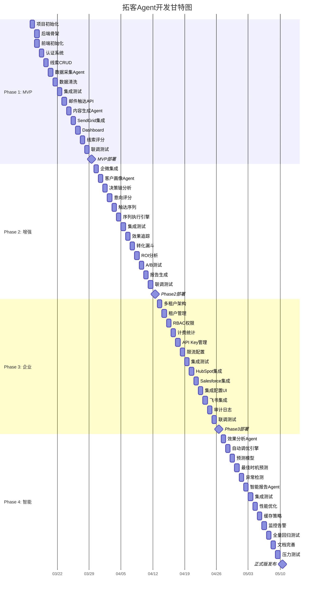

# 拓客Agent - 开发计划

> **文档版本**: V1.0  
> **制定日期**: 2026-03-10  
> **制定人**: 小pm  
> **项目周期**: 8周 (56天)

---

## 一、里程碑总览

| Phase | 名称 | 时间 | 目标 | 核心交付物 |
|-------|------|------|------|-----------|
| **Phase 1** | MVP | W1-W2 (14天) | 核心功能上线 | 线索采集 + 邮件触达 + 基础仪表盘 |
| **Phase 2** | 增强 | W3-W4 (14天) | 多渠道 + 画像 | 企微集成 + 客户画像 + 效果追踪 |
| **Phase 3** | 企业 | W5-W6 (14天) | 多租户 + API | 租户管理 + 开放API + CRM集成 |
| **Phase 4** | 智能 | W7-W8 (14天) | AI优化 | 自动调优 + 预测分析 + 报告生成 |

---

## 二、团队分工

### 2.1 团队角色定义

| 团队 | 负责人 | 职责范围 | 核心技能 |
|------|--------|----------|----------|
| **Daniel团队** | Daniel | 后端服务 + AI Agent + 数据层 | Python, FastAPI, LLM, PostgreSQL |
| **Peter团队** | Peter | 前端UI + 集成测试 + DevOps | TypeScript, Next.js, Docker, CI/CD |

### 2.2 详细分工表

| 模块/功能 | 负责团队 | 具体任务 |
|-----------|----------|----------|
| **API服务 (FastAPI)** | Daniel团队 | REST API设计、业务逻辑、认证授权 |
| **AI Agent层** | Daniel团队 | Agent编排、LLM调用、Prompt设计 |
| **数据处理** | Daniel团队 | 数据采集、清洗、去重、评分 |
| **数据库设计** | Daniel团队 | Schema设计、迁移、索引优化 |
| **任务队列** | Daniel团队 | Celery配置、任务调度、重试机制 |
| **前端UI (Next.js)** | Peter团队 | Dashboard、表单、图表、交互 |
| **API集成** | Peter团队 | 前端API调用、状态管理、错误处理 |
| **外部集成** | Peter团队 | 邮件服务、企微API、Webhook |
| **测试** | Peter团队 | 单元测试、集成测试、E2E测试 |
| **部署运维** | Peter团队 | Docker、CI/CD、监控告警 |

### 2.3 协作流程

```
┌──────────────────────────────────────────────────────────────┐
│                      产品需求 (小pm)                          │
└───────────────────────────┬──────────────────────────────────┘
                            │
            ┌───────────────┴───────────────┐
            ▼                               ▼
┌───────────────────────┐       ┌───────────────────────┐
│     Daniel团队        │       │     Peter团队         │
│  (后端 + AI + 数据)    │       │  (前端 + 集成 + 运维)  │
├───────────────────────┤       ├───────────────────────┤
│ • API设计/开发        │       │ • UI组件开发          │
│ • Agent配置          │       │ • API对接            │
│ • 数据处理           │       │ • 测试编写           │
│ • 业务逻辑           │       │ • 部署配置           │
└───────────┬───────────┘       └───────────┬───────────┘
            │                               │
            └───────────────┬───────────────┘
                            ▼
              ┌─────────────────────────┐
              │      联调测试 (协作)     │
              └─────────────────────────┘
```

---

## 三、Phase 1: MVP (W1-W2)

### 3.1 目标

- 线索采集核心功能（单一数据源）
- 邮件触达（单一渠道）
- 基础仪表盘
- 用户认证

### 3.2 任务清单

#### Week 1 (Day 1-7)

| Day | 任务 | 负责团队 | 预估工时 | 验收标准 |
|-----|------|----------|----------|----------|
| D1 | 项目初始化 | Peter | 4h | Git仓库创建、项目结构、Docker配置 |
| D1 | 数据库Schema设计 | Daniel | 4h | tenants, users, prospects, reach_records表创建 |
| D2 | FastAPI项目骨架 | Daniel | 6h | 路由结构、Pydantic模型、数据库连接 |
| D2 | Next.js项目初始化 | Peter | 4h | App Router、Tailwind、基础布局 |
| D3 | 认证API (JWT) | Daniel | 6h | 登录/注册/刷新Token API |
| D3 | 登录/注册页面 | Peter | 6h | 表单验证、Token存储、路由守卫 |
| D4 | 线索CRUD API | Daniel | 6h | 增删改查、分页、筛选 |
| D4 | 线索列表页面 | Peter | 6h | 表格、分页、搜索、筛选 |
| D5 | 数据采集Agent (企查查) | Daniel | 8h | 单一数据源采集、字段映射 |
| D5 | 采集任务管理页面 | Peter | 4h | 任务创建、进度显示 |
| D6 | 数据清洗去重 | Daniel | 6h | 去重算法、数据验证 |
| D6 | 线索导入导出 | Peter | 4h | Excel导入、CSV导出 |
| D7 | 集成测试 | 双方 | 6h | API测试、前端E2E测试 |

#### Week 2 (Day 8-14)

| Day | 任务 | 负责团队 | 预估工时 | 验收标准 |
|-----|------|----------|----------|----------|
| D8 | 邮件触达API | Daniel | 6h | 触达记录CRUD、发送状态管理 |
| D8 | 触达任务页面 | Peter | 4h | 任务创建、列表、状态 |
| D9 | 内容生成Agent (邮件) | Daniel | 8h | LLM邮件生成、模板渲染 |
| D9 | 邮件预览组件 | Peter | 4h | 富文本预览、变量替换 |
| D10 | SendGrid/Resend集成 | Peter | 6h | 邮件发送、Webhook接收 |
| D10 | 发送队列 (Celery) | Daniel | 6h | 任务队列、重试机制 |
| D11 | 基础仪表盘API | Daniel | 4h | 指标统计、趋势数据 |
| D11 | Dashboard页面 | Peter | 6h | 卡片组件、趋势图 |
| D12 | 线索评分算法 | Daniel | 4h | 多维度评分、等级划分 |
| D12 | 数据可视化优化 | Peter | 4h | 图表优化、加载状态 |
| D13 | 联调 + Bug修复 | 双方 | 8h | 端到端测试、问题修复 |
| D14 | 部署上线 (MVP) | Peter | 6h | Vercel + Railway部署 |

### 3.3 验收标准

| 功能 | 验收标准 |
|------|----------|
| 线索采集 | 可从企查查采集≥100条线索，自动清洗去重 |
| 邮件触达 | 可创建邮件任务，通过Resend发送≥50封邮件 |
| 仪表盘 | 显示线索数、触达数、打开率、回复率 |
| 认证 | 支持登录/注册/登出，JWT有效 |
| 部署 | 线上可访问，核心流程可用 |

---

## 四、Phase 2: 增强 (W3-W4)

### 4.1 目标

- 企业微信集成
- 客户画像模块
- 效果追踪模块
- 多步骤触达序列

### 4.2 任务清单

#### Week 3 (Day 15-21)

| Day | 任务 | 负责团队 | 预估工时 | 验收标准 |
|-----|------|----------|----------|----------|
| D15 | 企微API集成 | Peter | 6h | 企微认证、消息发送 |
| D15 | 客户画像数据模型 | Daniel | 4h | prospect_profiles表设计 |
| D16 | 画像生成Agent | Daniel | 8h | LLM分析、画像JSON生成 |
| D16 | 画像展示页面 | Peter | 6h | 画像卡片、维度展示 |
| D17 | 决策链分析 | Daniel | 6h | 组织推断、关键人识别 |
| D17 | 决策链可视化 | Peter | 4h | 组织架构图组件 |
| D18 | 意向评分算法 | Daniel | 4h | 购买信号、参与度计算 |
| D18 | 线索优先级排序 | Peter | 2h | 按评分排序、等级标签 |
| D19 | 触达序列配置 | Daniel | 6h | YAML配置解析、步骤管理 |
| D19 | 序列执行引擎 | Daniel | 6h | 条件判断、延迟调度 |
| D20 | 企微触达页面 | Peter | 4h | 好友请求、消息跟进 |
| D20 | 触达序列UI | Peter | 4h | 序列配置、步骤可视化 |
| D21 | 集成测试 | 双方 | 6h | 画像+触达联调 |

#### Week 4 (Day 22-28)

| Day | 任务 | 负责团队 | 预估工时 | 验收标准 |
|-----|------|----------|----------|----------|
| D22 | 效果追踪API | Daniel | 4h | 指标统计、漏斗数据 |
| D22 | 追踪像素/链接 | Peter | 4h | 打开追踪、点击追踪 |
| D23 | 转化漏斗页面 | Peter | 6h | 漏斗图、阶段详情 |
| D23 | Webhook处理 | Daniel | 4h | 邮件事件、企微事件 |
| D24 | ROI分析算法 | Daniel | 4h | 成本计算、收益归因 |
| D24 | ROI报告页面 | Peter | 4h | 成本/收益/ROI展示 |
| D25 | A/B测试框架 | Daniel | 6h | 变体管理、分配算法 |
| D25 | A/B测试UI | Peter | 4h | 创建测试、结果对比 |
| D26 | 报告生成Agent | Daniel | 6h | PDF/Excel报告生成 |
| D26 | 报告下载 | Peter | 2h | 报告列表、下载链接 |
| D27 | 联调 + Bug修复 | 双方 | 8h | 全流程测试 |
| D28 | Phase 2 部署 | Peter | 4h | 增量更新上线 |

### 4.3 验收标准

| 功能 | 验收标准 |
|------|----------|
| 企微集成 | 可发送企微消息，接收好友通过事件 |
| 客户画像 | 每条线索自动生成画像，包含5个维度 |
| 触达序列 | 支持≥5步骤的触达序列，条件执行 |
| 效果追踪 | 完整漏斗数据，ROI分析准确 |
| A/B测试 | 可对比2个变体的打开率、回复率 |

---

## 五、Phase 3: 企业 (W5-W6)

### 5.1 目标

- 多租户架构
- 开放API
- CRM集成 (HubSpot/Salesforce)
- 权限管理增强

### 5.2 任务清单

#### Week 5 (Day 29-35)

| Day | 任务 | 负责团队 | 预估工时 | 验收标准 |
|-----|------|----------|----------|----------|
| D29 | 多租户数据隔离 | Daniel | 6h | tenant_id过滤、行级安全 |
| D29 | 租户管理API | Daniel | 4h | 租户CRUD、配额管理 |
| D30 | 租户管理页面 | Peter | 6h | 租户列表、创建、配置 |
| D30 | RBAC权限模型 | Daniel | 6h | 角色、权限、资源映射 |
| D31 | 用户管理页面 | Peter | 6h | 用户列表、角色分配 |
| D31 | 权限中间件 | Daniel | 4h | API权限校验 |
| D32 | 计费统计 | Daniel | 4h | 使用量统计、账单计算 |
| D32 | 计费仪表盘 | Peter | 4h | 用量展示、账单历史 |
| D33 | API文档 (OpenAPI) | Daniel | 4h | 自动文档生成 |
| D33 | API Key管理 | Daniel | 4h | Key生成、权限、限流 |
| D34 | API Key管理UI | Peter | 4h | Key创建、列表、删除 |
| D34 | 限流配置 | Peter | 4h | 租户级限流 |
| D35 | 集成测试 | 双方 | 6h | 多租户隔离测试 |

#### Week 6 (Day 36-42)

| Day | 任务 | 负责团队 | 预估工时 | 验收标准 |
|-----|------|----------|----------|----------|
| D36 | HubSpot集成 | Peter | 6h | OAuth、联系人同步 |
| D36 | 同步任务 | Daniel | 4h | 增量同步、冲突处理 |
| D37 | Salesforce集成 | Peter | 6h | OAuth、线索同步 |
| D37 | Webhook推送 | Daniel | 4h | 事件推送、重试 |
| D38 | 集成配置页面 | Peter | 4h | CRM连接、字段映射 |
| D38 | 同步状态展示 | Peter | 2h | 同步进度、错误日志 |
| D39 | 飞书集成 | Peter | 6h | 飞书通知、群消息 |
| D39 | 通知模板 | Daniel | 4h | 通知内容模板 |
| D40 | 审计日志 | Daniel | 4h | 操作日志记录 |
| D40 | 审计日志UI | Peter | 2h | 日志查询、筛选 |
| D41 | 联调 + Bug修复 | 双方 | 8h | 企业功能测试 |
| D42 | Phase 3 部署 | Peter | 4h | 企业版上线 |

### 5.3 验收标准

| 功能 | 验收标准 |
|------|----------|
| 多租户 | 数据完全隔离，租户A无法访问租户B数据 |
| 权限管理 | 支持4种角色，权限精确到API级别 |
| 开放API | 提供完整REST API，支持API Key认证 |
| CRM集成 | 支持HubSpot和Salesforce双向同步 |
| 审计日志 | 记录所有敏感操作，保留90天 |

---

## 六、Phase 4: 智能 (W7-W8)

### 6.1 目标

- 自动调优
- 预测分析
- 智能报告
- 性能优化

### 6.2 任务清单

#### Week 7 (Day 43-49)

| Day | 任务 | 负责团队 | 预估工时 | 验收标准 |
|-----|------|----------|----------|----------|
| D43 | 效果分析Agent | Daniel | 6h | 历史数据分析、模式识别 |
| D43 | 调优建议生成 | Daniel | 4h | 策略优化建议 |
| D44 | 自动调优引擎 | Daniel | 8h | 参数自动调整、A/B自动选择 |
| D44 | 调优配置UI | Peter | 4h | 调优开关、参数范围 |
| D45 | 预测模型 (转化率) | Daniel | 6h | 转化概率预测 |
| D45 | 预测展示 | Peter | 4h | 预测标签、置信度 |
| D46 | 最佳时机预测 | Daniel | 6h | 发送时间优化 |
| D46 | 时机配置 | Peter | 2h | 自动发送开关 |
| D47 | 异常检测 | Daniel | 6h | 打开率异常、成本异常 |
| D47 | 告警通知 | Peter | 4h | 邮件/企微告警 |
| D48 | 智能报告Agent | Daniel | 6h | 周报/月报自动生成 |
| D48 | 报告订阅 | Peter | 4h | 定期报告配置 |
| D49 | 集成测试 | 双方 | 6h | 智能功能测试 |

#### Week 8 (Day 50-56)

| Day | 任务 | 负责团队 | 预估工时 | 验收标准 |
|-----|------|----------|----------|----------|
| D50 | 性能优化 (API) | Daniel | 6h | 响应时间<200ms |
| D50 | 性能优化 (前端) | Peter | 6h | LCP<2s |
| D51 | 缓存策略 | Daniel | 4h | Redis缓存热点数据 |
| D51 | 数据库优化 | Daniel | 4h | 索引优化、查询优化 |
| D52 | 监控告警配置 | Peter | 6h | Prometheus + Grafana |
| D52 | 日志聚合 | Peter | 4h | Loki配置 |
| D53 | 全量回归测试 | 双方 | 8h | 所有功能E2E测试 |
| D54 | 文档完善 | 双方 | 6h | API文档、用户手册 |
| D55 | 压力测试 | Peter | 6h | 并发1000 QPS |
| D56 | Phase 4 上线 | Peter | 4h | 正式版发布 |

### 6.3 验收标准

| 功能 | 验收标准 |
|------|----------|
| 自动调优 | 可自动选择最优邮件模板和发送时间 |
| 预测分析 | 转化率预测准确率>70% |
| 智能报告 | 每周自动生成分析报告 |
| 性能 | API P95<200ms，前端LCP<2s |
| 可用性 | 99.9% SLA |

---

## 七、甘特图 (Mermaid)



---

## 八、资源需求

### 8.1 人力投入

| 角色 | 人数 | 投入比例 | Phase 1 | Phase 2 | Phase 3 | Phase 4 |
|------|------|----------|---------|---------|---------|---------|
| 后端开发 | 2 | 100% | ✓ | ✓ | ✓ | ✓ |
| 前端开发 | 2 | 100% | ✓ | ✓ | ✓ | ✓ |
| AI工程师 | 1 | 50% | ✓ | ✓ | - | ✓ |
| 测试工程师 | 1 | 50% | - | ✓ | ✓ | ✓ |
| 产品经理 | 1 | 30% | ✓ | ✓ | ✓ | ✓ |
| DevOps | 1 | 30% | ✓ | ✓ | ✓ | ✓ |

### 8.2 基础设施成本

| 服务 | 配置 | 月费用 | Phase |
|------|------|--------|-------|
| Vercel (前端) | Pro | $20 | P1-P4 |
| Railway (后端) | $20/月 | $20 | P1 |
| Railway (后端) | $50/月 | $50 | P2-P4 |
| Supabase (数据库) | Pro | $25 | P1-P4 |
| Upstash (Redis) | $10/月 | $10 | P1-P4 |
| OpenAI API | 按量 | $100-300 | P1-P4 |
| Anthropic API | 按量 | $100-300 | P2-P4 |
| 域名+SSL | .com | $12/年 | P1 |
| **总计** | | **$300-500/月** | |

### 8.3 外部服务

| 服务 | 用途 | 费用 | Phase |
|------|------|------|-------|
| 企查查API | 企业数据 | ¥2000/月 | P1-P4 |
| Resend/SendGrid | 邮件发送 | $20/月 | P1-P4 |
| 企业微信 | 企微触达 | 免费 | P2-P4 |

---

## 九、风险管理

### 9.1 技术风险

| 风险 | 概率 | 影响 | 缓解措施 |
|------|------|------|----------|
| LLM API成本失控 | 中 | 高 | 使用GPT-4o-mini，实现缓存，监控用量 |
| 邮件到达率低 | 中 | 高 | 使用专业邮件服务，预热域名，SPF/DKIM |
| 企微API限流 | 低 | 中 | 实现请求队列，控制频率 |
| 数据库性能瓶颈 | 低 | 中 | 索引优化，读写分离，连接池 |

### 9.2 进度风险

| 风险 | 概率 | 影响 | 缓解措施 |
|------|------|------|----------|
| 需求变更 | 高 | 中 | 冻结Phase 1需求，后续Phase可调整 |
| 技术难点超预期 | 中 | 中 | 预留缓冲时间，复杂功能降级 |
| 人员变动 | 低 | 高 | 文档完善，知识共享 |
| 第三方服务故障 | 低 | 中 | 多服务商备选，降级方案 |

### 9.3 业务风险

| 风险 | 概率 | 影响 | 缓解措施 |
|------|------|------|----------|
| 数据合规问题 | 中 | 高 | 用户授权，透明操作，法务审核 |
| 竞品压力 | 高 | 中 | 快速迭代，差异化功能 |
| 客户接受度低 | 中 | 高 | MVP快速验证，用户反馈循环 |

---

## 十、质量保障

### 10.1 代码质量

| 指标 | 目标 | 工具 |
|------|------|------|
| 代码覆盖率 | >80% | pytest-cov, Jest |
| 代码规范 | PEP8/ESLint | flake8, ESLint |
| 类型检查 | 100% | mypy, TypeScript |
| 安全扫描 | 0高危 | Bandit, npm audit |

### 10.2 测试策略

| 测试类型 | 覆盖范围 | 频率 |
|----------|----------|------|
| 单元测试 | 所有业务逻辑 | 每次提交 |
| 集成测试 | API + 数据库 | 每日 |
| E2E测试 | 核心用户流程 | 每周 |
| 压力测试 | 关键API | 每Phase |
| 安全测试 | 认证/授权/注入 | 每Phase |

### 10.3 发布流程

```
开发 → 代码审查 → 单元测试 → 集成测试 → Staging验证 → 生产发布
         ↓           ↓           ↓            ↓            ↓
       PR审核      覆盖率检查    E2E测试     UAT验收      灰度发布
```

---

## 十一、里程碑检查点

### 11.1 Phase 1 检查点 (Day 14)

- [ ] 线索采集功能可用
- [ ] 邮件触达功能可用
- [ ] 基础仪表盘显示
- [ ] 用户认证正常
- [ ] 线上部署成功
- [ ] 核心流程E2E测试通过

### 11.2 Phase 2 检查点 (Day 28)

- [ ] 企微触达功能可用
- [ ] 客户画像自动生成
- [ ] 触达序列自动执行
- [ ] 转化漏斗数据正确
- [ ] A/B测试功能可用

### 11.3 Phase 3 检查点 (Day 42)

- [ ] 多租户数据隔离
- [ ] 权限管理精确
- [ ] 开放API文档完整
- [ ] CRM集成可用
- [ ] 审计日志记录

### 11.4 Phase 4 检查点 (Day 56)

- [ ] 自动调优功能可用
- [ ] 预测分析准确率>70%
- [ ] 智能报告自动生成
- [ ] 性能指标达标
- [ ] 全量测试通过

---

## 十二、后续规划 (Post Phase 4)

### 12.1 功能扩展

| 功能 | 优先级 | 预估时间 |
|------|--------|----------|
| 电话触达 (AI拨打) | P1 | 2周 |
| LinkedIn自动化 | P1 | 2周 |
| 行业模板库 | P2 | 1周 |
| 移动端App | P2 | 4周 |
| 离线数据包 | P2 | 1周 |

### 12.2 技术债务

| 项目 | 优先级 | 预估时间 |
|------|--------|----------|
| 测试覆盖率提升至90% | P1 | 1周 |
| API性能优化 | P1 | 1周 |
| 日志/监控完善 | P2 | 1周 |
| 代码重构 | P2 | 2周 |

---

## 附录A: 每日站会议程

1. **昨天完成了什么** (每人1分钟)
2. **今天计划做什么** (每人1分钟)
3. **有什么阻碍** (集体讨论)

---

## 附录B: 周报模板

```markdown
# 拓客Agent 周报 - Week X

## 本周完成
- [ ] 任务1
- [ ] 任务2

## 下周计划
- [ ] 任务3
- [ ] 任务4

## 风险/问题
- 问题描述
- 解决方案

## 关键指标
- 开发进度: X%
- 测试覆盖率: X%
- Bug数量: X
```

---

## 附录C: 技术栈确认

| 层级 | 技术 | 版本 |
|------|------|------|
| 后端框架 | FastAPI | 0.109+ |
| 前端框架 | Next.js | 14+ |
| 数据库 | PostgreSQL + pgvector | 16 |
| 缓存 | Redis | 7+ |
| 任务队列 | Celery | 5.3+ |
| Agent编排 | OpenClaw | Latest |
| LLM | GPT-4o / Claude 3.5 | - |
| 邮件服务 | Resend | - |
| 部署 | Railway + Vercel | - |

---

**文档版本**: V1.0  
**完成时间**: 2026-03-10  
**制定人**: 小pm
