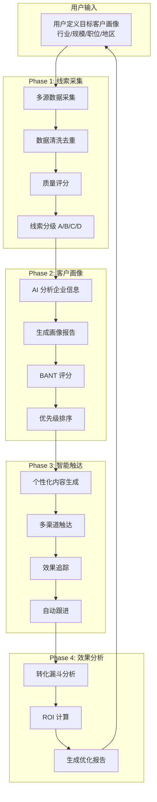
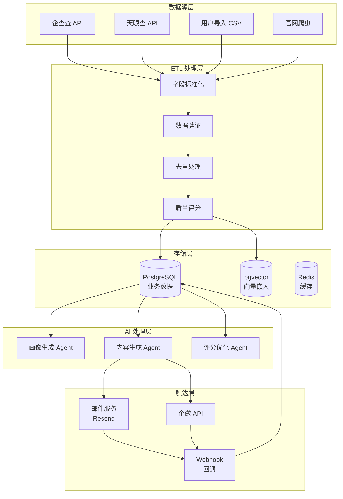
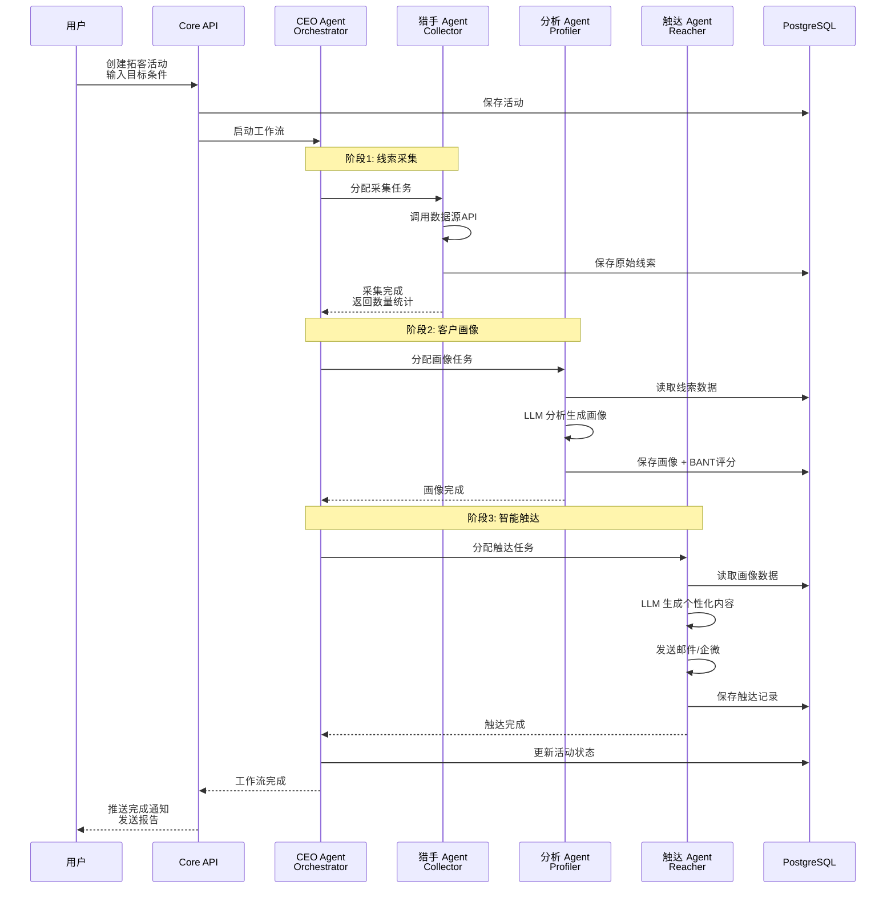
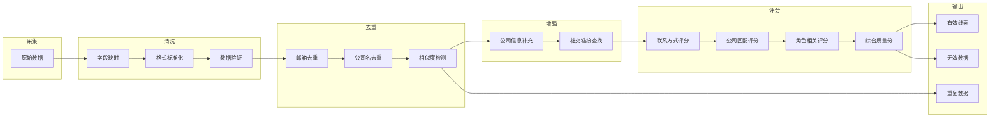
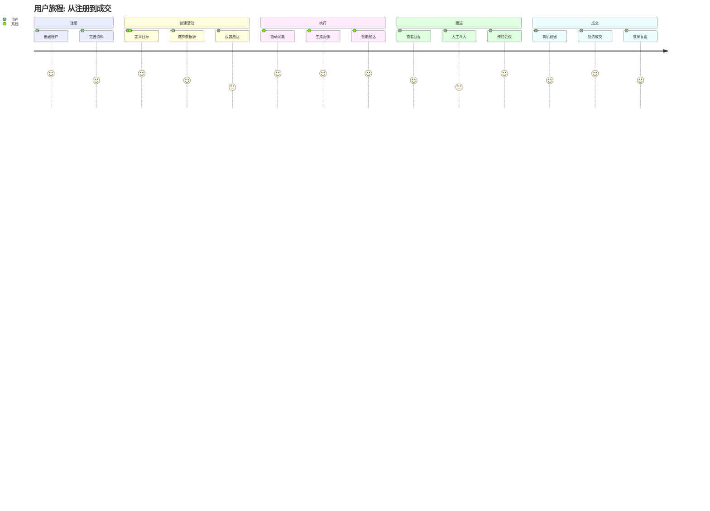
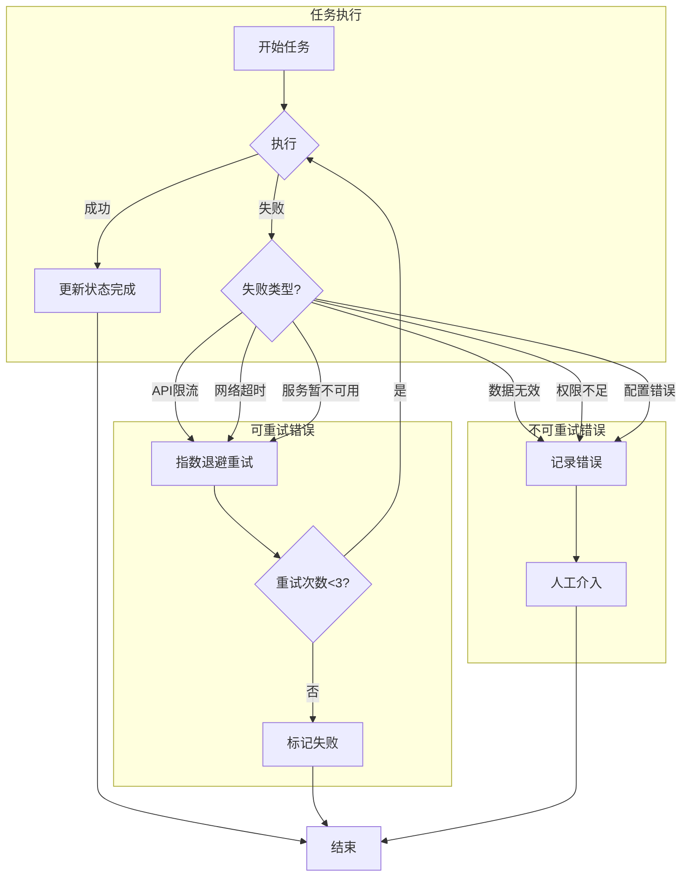

# 拓客智能体项目梳理

> 文档生成时间：2026-04-24
> 基于：PRD v2.0 + 架构文档 + 5大难点方案 + 功能设计文档

---

## 一、产品原型图（逻辑结构）

### 1.1 整体产品架构

```
┌─────────────────────────────────────────────────────────────────────────┐
│                           用户界面层 (Frontend)                           │
├─────────────────────────────────────────────────────────────────────────┤
│  ┌──────────────┐  ┌──────────────┐  ┌──────────────┐  ┌──────────────┐ │
│  │   仪表盘     │  │  线索管理    │  │  活动管理    │  │  报告中心    │ │
│  │  Dashboard   │  │  Prospects   │  │  Campaigns   │  │   Reports    │ │
│  └──────────────┘  └──────────────┘  └──────────────┘  └──────────────┘ │
│  ┌──────────────┐  ┌──────────────┐  ┌──────────────┐  ┌──────────────┐ │
│  │   画像查看   │  │  触达记录    │  │  模板管理    │  │  系统设置    │ │
│  │   Profile    │  │   Reaches    │  │  Templates   │  │   Settings   │ │
│  └──────────────┘  └──────────────┘  └──────────────┘  └──────────────┘ │
└─────────────────────────────────────────────────────────────────────────┘
                                    │
                                    ▼
┌─────────────────────────────────────────────────────────────────────────┐
│                          API 网关层 (Gateway)                             │
├─────────────────────────────────────────────────────────────────────────┤
│  ┌──────────────┐  ┌──────────────┐  ┌──────────────┐  ┌──────────────┐ │
│  │  认证授权    │  │  限流熔断    │  │  路由分发    │  │  访问日志    │ │
│  │    Auth      │  │  Rate Limit  │  │   Routing    │  │    Logs      │ │
│  └──────────────┘  └──────────────┘  └──────────────┘  └──────────────┘ │
└─────────────────────────────────────────────────────────────────────────┘
                                    │
                                    ▼
┌─────────────────────────────────────────────────────────────────────────┐
│                          核心业务层 (Backend)                             │
├─────────────────────────────────────────────────────────────────────────┤
│                                                                         │
│  ┌─────────────────────────────────────────────────────────────────┐   │
│  │                      CEO Agent (调度中心)                        │   │
│  │              解析需求 → 拆解任务 → 调度Agent → 汇总交付          │   │
│  └────────┬──────────┬──────────┬──────────┬──────────┬────────────┘   │
│           │          │          │          │          │                │
│           ▼          ▼          ▼          ▼          ▼                │
│      ┌────────┐ ┌────────┐ ┌────────┐ ┌────────┐ ┌────────┐           │
│      │  猎手  │ │  分析  │ │  文案  │ │  触达  │ │  跟进  │           │
│      │ Agent  │ │ Agent  │ │ Agent  │ │ Agent  │ │ Agent  │           │
│      │        │ │        │ │        │ │        │ │        │           │
│      │线索采集│ │画像生成│ │内容生成│ │邮件/企微│ │客户维护│           │
│      │数据清洗│ │BANT评分│ │个性化  │ │发送执行│ │时机判断│           │
│      └────────┘ └────────┘ └────────┘ └────────┘ └────────┘           │
│                                                                         │
└─────────────────────────────────────────────────────────────────────────┘
                                    │
                                    ▼
┌─────────────────────────────────────────────────────────────────────────┐
│                          数据基础设施层 (Data)                            │
├─────────────────────────────────────────────────────────────────────────┤
│  ┌────────────────┐  ┌────────────────┐  ┌────────────────┐             │
│  │  PostgreSQL    │  │    Redis       │  │   MinIO        │             │
│  │  + pgvector    │  │  (缓存/队列)    │  │  (文件存储)     │             │
│  │                │  │                │  │                │             │
│  │ • 业务数据     │  │ • 会话缓存     │  │ • 报告文件     │             │
│  │ • 向量嵌入     │  │ • 任务队列     │  │ • 导入模板     │             │
│  │ • 全文搜索     │  │ • 实时状态     │  │ • 附件存储     │             │
│  └────────────────┘  └────────────────┘  └────────────────┘             │
└─────────────────────────────────────────────────────────────────────────┘
                                    │
                                    ▼
┌─────────────────────────────────────────────────────────────────────────┐
│                          外部服务层 (External)                            │
├─────────────────────────────────────────────────────────────────────────┤
│  ┌──────────────┐  ┌──────────────┐  ┌──────────────┐  ┌──────────────┐ │
│  │   LLM APIs   │  │  数据源API   │  │  邮件服务    │  │  企微API     │ │
│  │  DeepSeek    │  │  企查查      │  │  Resend      │  │  企业微信    │ │
│  │  GPT-4o      │  │  天眼查      │  │  SendGrid    │  │              │ │
│  └──────────────┘  └──────────────┘  └──────────────┘  └──────────────┘ │
└─────────────────────────────────────────────────────────────────────────┘
```

---

### 1.2 核心页面原型

#### 1.2.1 仪表盘 (Dashboard)

```
┌─────────────────────────────────────────────────────────────────────────┐
│  [Logo] 拓客智能体                                    [🔔] [👤 用户名 ▼] │
├──────────┬──────────────────────────────────────────────────────────────┤
│          │  总览                                                          │
│  仪表盘  │  ┌──────────┐ ┌──────────┐ ┌──────────┐ ┌──────────┐         │
│  线索    │  │ 总线索   │ │ 已触达   │ │ 有回复   │ │ 成交数   │         │
│  活动    │  │  1,234   │ │   856    │ │   123    │ │    12    │         │
│  报告    │  │ +56 今日 │ │ +12 今日 │ │ +5 今日  │ │ +2 本月  │         │
│  设置    │  └──────────┘ └──────────┘ └──────────┘ └──────────┘         │
│          │                                                                │
│ ──────── │  活动进度                                                      │
│          │  ┌────────────────────────────────────────────────────────┐   │
│  快速操作│  │ 活动A: SaaS行业CTO采集    [████████░░] 80%  预计2小时后完成 │   │
│  + 新建  │  │ 活动B: 制造业CIO触达      [██████░░░░] 60%  进行中       │   │
│  活动    │  │ 活动C: 跨境电商画像生成   [██████████] 100% 已完成      │   │
│          │  └────────────────────────────────────────────────────────┘   │
│ ──────── │                                                                │
│          │  转化漏斗                                                      │
│  数据源  │  ┌────────────────────────────────────────────────────────┐   │
│  模板    │  │ 线索(100%) → 触达(85%) → 打开(42%) → 回复(10%) → 成交(3%) │   │
│  成员    │  │ [███████]   [█████░]    [███░░░]    [█░░░░░]    [▓░░░░░] │   │
│          │  └────────────────────────────────────────────────────────┘   │
│          │                                                                │
│          │  最近动态                                                      │
│          │  ┌────────────────────────────────────────────────────────┐   │
│          │  │ • 10:23 活动A采集完成，新增线索156条                     │   │
│          │  │ • 09:45 张三回复了邮件，标记为"有兴趣"                   │   │
│          │  │ • 09:12 活动B触达任务暂停（达到日限额）                  │   │
│          │  └────────────────────────────────────────────────────────┘   │
└──────────┴──────────────────────────────────────────────────────────────┘
```

#### 1.2.2 线索管理 (Prospects)

```
┌─────────────────────────────────────────────────────────────────────────┐
│  [Logo] 拓客智能体                                    [🔔] [👤 用户名 ▼] │
├──────────┬──────────────────────────────────────────────────────────────┤
│          │  线索管理                                          [+ 新建] │
│          │  ┌────────────────────────────────────────────────────────┐   │
│  筛选:   │  │ [搜索...    ] [行业 ▼] [评分 ▼] [状态 ▼] [导出 CSV]    │   │
│  SaaS    │  └────────────────────────────────────────────────────────┘   │
│  制造业  │                                                                │
│  电商    │  ┌────────────────────────────────────────────────────────┐   │
│          │  │ □ │ 姓名    │ 公司      │ 职位    │ 评分 │ 状态   │ 操作 │   │
│ ──────── │  ├───┼─────────┼───────────┼─────────┼──────┼────────┼──────┤   │
│          │  │ □ │ 张三    │ 某某科技  │ CTO     │ 92 A │ 新线索 │ [画像│   │
│  排序:   │  │ □ │ 李四    │ ABC公司   │ VP Eng  │ 85 A │ 已触达 │ [画像│   │
│  评分↓   │  │ □ │ 王五    │ 创新企业  │ 技术总监│ 78 B │ 有回复 │ [画像│   │
│  时间    │  │ □ │ 赵六    │ 传统企业  │ IT经理  │ 65 B │ 已触达 │ [画像│   │
│          │  │ □ │ ...     │ ...       │ ...     │ ...  │ ...    │ ...  │   │
│          │  └───┴─────────┴───────────┴─────────┴──────┴────────┴──────┘   │
│          │                                                                │
│          │  [共 156 条]              [< 1  2  3  ... 10 >]                │
└──────────┴──────────────────────────────────────────────────────────────┘
```

#### 1.2.3 线索画像详情 (Profile)

```
┌─────────────────────────────────────────────────────────────────────────┐
│  [Logo] 拓客智能体                                    [< 返回线索列表]    │
├─────────────────────────────────────────────────────────────────────────┤
│                                                                         │
│  ┌─────────────────────────────────────────────────────────────────┐   │
│  │  ┌────┐                                                         │   │
│  │  │ 👤 │  张三                    评分: A (92分)                  │   │
│  │  └────┘  CTO @ 某某科技有限公司   [⭐ 优先跟进]                   │   │
│  │          zhangsan@example.com   138****1234                     │   │
│  └─────────────────────────────────────────────────────────────────┘   │
│                                                                         │
│  ┌────────────────────┐  ┌──────────────────────────────────────────┐  │
│  │  角色特征          │  │  需求分析                                │  │
│  │  ─────────         │  │  ─────────                               │  │
│  │  决策级别: 高      │  │  潜在痛点:                               │  │
│  │  关注重点:         │  │  • 数据孤岛，系统间不互通                │  │
│  │  • 技术架构        │  │  • 研发效率低，交付周期长                │  │
│  │  • 团队效率        │  │  • 人才流失，招聘困难                    │  │
│  │  • 成本控制        │  │                                          │  │
│  │                    │  │  购买动机: 提升效率、降低成本            │  │
│  │  可能KPI:          │  │                                          │  │
│  │  • 研发交付速度    │  │  预期方案: DevOps平台、协作工具          │  │
│  │  • 系统稳定性      │  │                                          │  │
│  │  • 团队留存率      │  │  预算指标: 高 (公司有融资)               │  │
│  └────────────────────┘  └──────────────────────────────────────────┘  │
│                                                                         │
│  ┌────────────────────┐  ┌──────────────────────────────────────────┐  │
│  │  触达建议          │  │  互动历史                                │  │
│  │  ─────────         │  │  ─────────                               │  │
│  │  推荐渠道: 邮件    │  │  • 2026-04-20 发送介绍邮件 [已打开]      │  │
│  │  沟通风格: 专业    │  │  • 2026-04-22 发送案例邮件 [未打开]      │  │
│  │  最佳时间: 上午    │  │  • 2026-04-24 企微好友请求 [待通过]      │  │
│  │                    │  │                                          │  │
│  │  推荐话题:         │  │                                          │  │
│  │  • 技术架构升级    │  │                                          │  │
│  │  • 团队效能提升    │  │                                          │  │
│  │  • 同类客户案例    │  │                                          │  │
│  │                    │  │                                          │  │
│  │  避免话题:         │  │                                          │  │
│  │  • 价格谈判        │  │                                          │  │
│  │  • 过多产品功能    │  │                                          │  │
│  └────────────────────┘  └──────────────────────────────────────────┘  │
│                                                                         │
│                              [✉️ 立即触达] [📅 预约跟进] [📝 编辑画像]   │
└─────────────────────────────────────────────────────────────────────────┘
```

#### 1.2.4 新建活动 (Create Campaign)

```
┌─────────────────────────────────────────────────────────────────────────┐
│  [Logo] 拓客智能体                                    [👤 用户名 ▼]      │
├─────────────────────────────────────────────────────────────────────────┤
│  新建拓客活动                                                            │
│  ━━━━━━━━━━━━━━━━━━━━━━━━━━━━━━━━━━━━━━━━━━━━━━━━━━━━━━━━━━━━━━━━━━━━   │
│                                                                         │
│  基本信息                                                                │
│  ┌─────────────────────────────────────────────────────────────────┐   │
│  │  活动名称 *  [输入活动名称...                                    ]│   │
│  │                                                                  │   │
│  │  活动描述    [输入活动描述（可选）...                            ]│   │
│  └─────────────────────────────────────────────────────────────────┘   │
│                                                                         │
│  目标客户定义                                                            │
│  ┌─────────────────────────────────────────────────────────────────┐   │
│  │  行业 *      [☑ SaaS] [☑ 云计算] [☐ 制造业] [☐ 电商] [+ 更多]   │   │
│  │                                                                  │   │
│  │  公司规模    [☑ 50-200人] [☑ 200-500人] [☐ 500-1000人]         │   │
│  │                                                                  │   │
│  │  目标职位 *  [☑ CTO] [☑ VP Engineering] [☑ 技术总监]           │   │
│  │                                                                  │   │
│  │  地区        [☑ 北京] [☑ 上海] [☑ 深圳] [☑ 杭州] [+ 更多]      │   │
│  │                                                                  │   │
│  │  线索数量    [ 100 ] 条（推荐50-500条）                          │   │
│  └─────────────────────────────────────────────────────────────────┘   │
│                                                                         │
│  数据源配置                                                              │
│  ┌─────────────────────────────────────────────────────────────────┐   │
│  │  [☑] 企查查API（优先）                                          │   │
│  │  [☑] 天眼查API                                                  │   │
│  │  [☐] 用户导入数据                                               │   │
│  │  [☐] 官网爬虫（较慢）                                           │   │
│  └─────────────────────────────────────────────────────────────────┘   │
│                                                                         │
│  触达设置（可选）                                                        │
│  ┌─────────────────────────────────────────────────────────────────┐   │
│  │  [☐] 开启自动触达                                               │   │
│  │       选择模板: [选择邮件模板... ▼]                             │   │
│  │       日发送上限: [ 50 ] 封                                     │   │
│  └─────────────────────────────────────────────────────────────────┘   │
│                                                                         │
│                              [取消]        [创建活动]                   │
└─────────────────────────────────────────────────────────────────────────┘
```

#### 1.2.5 活动详情 (Campaign Detail)

```
┌─────────────────────────────────────────────────────────────────────────┐
│  [Logo] 拓客智能体                                    [< 返回活动列表]    │
├─────────────────────────────────────────────────────────────────────────┤
│  SaaS行业CTO采集活动                        [▶️ 继续] [⏸️ 暂停] [🗑️]    │
│  ━━━━━━━━━━━━━━━━━━━━━━━━━━━━━━━━━━━━━━━━━━━━━━━━━━━━━━━━━━━━━━━━━━━━   │
│                                                                         │
│  状态: 进行中 (78%)    创建时间: 2026-04-20    预计完成: 2小时后         │
│                                                                         │
│  ┌─────────────────────────────────────────────────────────────────┐   │
│  │  阶段进度                                                        │   │
│  │  ┌──────────┐   ┌──────────┐   ┌──────────┐   ┌──────────┐     │   │
│  │  │  采集    │ → │  画像    │ → │  触达    │ → │  分析    │     │   │
│  │  │  ████████│   │  ██████░░│   │  ██░░░░░░│   │  ░░░░░░░░│     │   │
│  │  │  156/200 │   │  120/156 │   │  50/156  │   │  等待中  │     │   │
│  │  │  ✓ 完成  │   │  进行中  │   │  待开始  │   │  待开始  │     │   │
│  │  └──────────┘   └──────────┘   └──────────┘   └──────────┘     │   │
│  └─────────────────────────────────────────────────────────────────┘   │
│                                                                         │
│  ┌────────────────────┐  ┌──────────────────────────────────────────┐  │
│  │  采集统计          │  │  触达效果                                │  │
│  │  ─────────         │  │  ─────────                               │  │
│  │  总采集: 156       │  │  已发送: 50                              │  │
│  │  去重后: 156       │  │  送达率: 96%                             │  │
│  │  有效率: 82%       │  │  打开率: 38%                             │  │
│  │  A级: 45 (29%)     │  │  回复率: 8%                              │  │
│  │  B级: 67 (43%)     │  │                                          │  │
│  │  C级: 44 (28%)     │  │  [查看详细报告]                          │  │
│  └────────────────────┘  └──────────────────────────────────────────┘  │
│                                                                         │
│  实时日志                                                                │
│  ┌─────────────────────────────────────────────────────────────────┐   │
│  │  10:23:45  [画像] 完成张三的画像生成，评分: 92 A级               │   │
│  │  10:23:12  [触达] 发送邮件给李四，邮件ID: msg_xxx                │   │
│  │  10:22:58  [采集] 从企查查获取15条新线索                        │   │
│  │  10:22:30  [画像] 完成王五的画像生成，评分: 78 B级               │   │
│  │  ...                                                            │   │
│  └─────────────────────────────────────────────────────────────────┘   │
└──────────┬──────────────────────────────────────────────────────────────┘
           │
           ▼
┌─────────────────────────────────────────────────────────────────────────┐
│  线索列表（本活动）                                         [导出 CSV]  │
│  ┌─────────────────────────────────────────────────────────────────┐   │
│  │ □ │ 姓名    │ 公司      │ 职位    │ 评分 │ 状态    │ 触达状态    │   │
│  │ □ │ 张三    │ 某某科技  │ CTO     │ 92 A │ 有画像  │ 待触达      │   │
│  │ □ │ 李四    │ ABC公司   │ VP Eng  │ 85 A │ 有画像  │ 已发送-待开 │   │
│  │ □ │ ...     │ ...       │ ...     │ ...  │ ...     │ ...         │   │
│  └─────────────────────────────────────────────────────────────────┘   │
└─────────────────────────────────────────────────────────────────────────┘
```

---

## 二、五大卡点难点

### 2.1 难点优先级排序

```
优先级排序 (从高到低):

1. 🔴 合规风险 (难点 4)
   → 必须 MVP 前解决，否则产品可能被迫下架
   → 阻塞: 所有数据采集和使用流程

2. 🔴 数据源获取 (难点 1)
   → 核心阻塞点，没有数据就没有产品
   → 阻塞: 线索采集 → 画像 → 触达

3. 🟡 LLM 成本控制 (难点 5)
   → 决定商业模式是否成立
   → 阻塞: 定价模型 → 盈利能力

4. 🟡 成交闭环冷启动 (难点 3)
   → 决定产品体验，但不阻塞 MVP 上线
   → 规则引擎可以撑 3 个月

5. 🟢 私域引流 (难点 2)
   → MVP 完全绕过，邮件触达即可
   → 等验证核心价值后再评估
```

### 2.2 难点详解与突破方案

#### 难点 1: 数据源获取 🟡→🔴

**问题本质**：
企业联系方式被企查查/天眼查垄断，无免费高质量源。中国 B2B 企业联系方式数据被少数平台垄断，没有「公开 + 免费 + 高质量」的数据源，只能用钱换数据或用时间换数据。

**卡点分析**：
| 卡点 | 影响 | 当前状态 |
|------|------|----------|
| 企查查 API 费用 | ¥999/月起 | 未购买，决策待定 |
| 数据覆盖率 | 目标≥60% | 未验证 |
| 数据质量 | 目标有效率≥80% | 未验证 |
| 多源融合 | 技术方案待实现 | 文档已完成 |

**突破方案**：
```
分层数据源策略:

Tier 1 (付费API - 主)
├── 企查查 API (¥999/月)
├── 天眼查 API (¥3000-10000/年)
└── 爱企查 API (¥0.01-0.03/次)

Tier 2 (公开采集 - 辅)
├── 官网爬虫 (Scrapy + Playwright)
├── 工商公示数据
└── 招聘网站数据

Tier 3 (用户导入 - 补充)
├── Excel/CSV 导入
├── CRM 同步
└── 手动录入

Tier 4 (社区贡献 - 长期)
├── 用户验证反馈奖励
├── 数据众包
└── 合作伙伴共享
```

**关键决策**：
- [ ] **是否购买企查查 API** (截止: Day 1) - 建议先买1个月测试
- [ ] **目标行业聚焦** - 建议 SaaS + 跨境电商

---

#### 难点 2: 私域引流 🔴

**问题本质**：
你在对抗中国最顶尖的反自动化风控团队。小红书/脉脉/微信的安全团队投入数亿，你的 Playwright 脚本几乎不可能持久绕过他们的检测。封号 = 失去所有积累的客户关系，是不可逆的致命风险。

**卡点分析**：
| 卡点 | 风险等级 | 当前策略 |
|------|----------|----------|
| 小红书反爬 | 极高 | **MVP 不做** |
| 脉脉封号 | 极高 | **MVP 不做** |
| 企微限制 | 中 | Phase 2 接入 |
| 邮件送达 | 低 | Phase 1 主力 |

**突破方案**：
```
三层触达体系:

Tier 1: 邮件触达 (MVP 主力)
├── Resend / SendGrid
├── 送达率 ≥90%
├── 打开率 ≥25%
└── ✅ 合规、可控、成本低

Tier 2: AI Copilot (Phase 2)
├── AI 生成话术
├── 人工一键复制发送
├── 效果追踪反馈学习
└── ✅ 极低封号风险

Tier 3: 自动化触达 (Phase 3, 高风险)
├── 指纹浏览器
├── 代理池
├── 行为模拟
└── ⚠️ 仅 ROI 验证后考虑
```

**Phase 1 明确不做**：
- ❌ 小红书自动化
- ❌ 脉脉自动化
- ❌ LinkedIn 自动化
- ✅ 只走邮件 + 人工辅助

---

#### 难点 3: 成交闭环冷启动 🔴

**问题本质**：
没有历史成交数据就无法训练「什么样的线索更容易成交」的模型，但没有好模型就无法高效成单，从而无法积累数据——这是一个经典的冷启动死循环。

**卡点分析**：
| 卡点 | 挑战 | 解决方案 |
|------|------|----------|
| 无标注数据 | 无法训练 ML 模型 | 先用规则引擎 |
| 评分不准确 | 早期用户体验差 | 人工校准 + 反馈驱动 |
| 冷启动期长 | 3-6 个月积累期 | 行业基准权重启动 |

**突破方案**：
```
三阶段演进:

Phase 1 (Week 1-4): 规则引擎
├── BANT 硬编码权重
├── 行业基准初始化
├── 人工审核 Top 10 校准
└── 目标准确率: ≥70%

Phase 2 (Month 2-3): 反馈驱动
├── 用户反馈收集 ("这个线索有用吗？")
├── A/B 测试框架
├── 贝叶斯权重更新
└── 目标准确率: ≥80%

Phase 3 (Month 4+): ML 模型
├── LightGBM 训练
├── 特征工程自动化
├── 模型漂移检测
└── 目标准确率: ≥85%
```

**MVP 策略**：
先用规则引擎 + 行业知识库，不依赖 ML。评分可解释，用户能看到每个维度的得分。

---

#### 难点 4: 合规风险 🔴

**问题本质**：
中国的个人信息保护法 (PIPL) 对「未经同意的自动化个人信息处理」设置了严格约束，但 B2B 拓客的核心流程（采集联系方式 → 自动触达）恰好踩在这条线上。

**卡点分析**：
| 卡点 | 风险 | 缓解措施 |
|------|------|----------|
| 数据采集合法性 | 高 | 只用公开数据+授权数据 |
| 个人信息保护 | 高 | Privacy-by-Design |
| 跨境数据传输 | 中 | 国内 LLM + 国内云 |
| 营销同意机制 | 中 | 退订机制+同意记录 |

**突破方案**：
```
Privacy-by-Design 合规架构:

┌─────────────────────────────────────────────────────────┐
│                    合规治理层                             │
│  ┌──────────────┐  ┌──────────────┐  ┌──────────────┐  │
│  │ 数据分类分级  │  │  同意管理     │  │  审计日志     │  │
│  └──────┬───────┘  └──────┬───────┘  └──────┬───────┘  │
│         └─────────────────┼─────────────────┘          │
│                           ▼                             │
│  ┌─────────────────────────────────────────────────┐   │
│  │              数据保护网关                          │   │
│  │     • PII 检测 + 脱敏                              │   │
│  │     • 跨境传输检查                                 │   │
│  │     • 保留期限检查                                 │   │
│  │     • 访问权限检查                                 │   │
│  └─────────────────────────────────────────────────┘   │
└─────────────────────────────────────────────────────────┘
```

**关键措施**：
1. **数据分类**: 公开数据 / 个人信息 / 敏感信息
2. **PII 脱敏**: 手机号 138****1234，邮箱 a***@example.com
3. **数据加密**: AES-256-GCM 存储加密
4. **审计日志**: 谁在什么时候查了什么数据
5. **数据生命周期**: 自动清理过期数据
6. **用户权利**: 查阅、更正、删除、导出

**铁律**: 只用公开数据+授权数据，不做任何非法采集。

---

#### 难点 5: LLM 成本控制 🟡

**问题本质**：
Agent 编排的上下文传递和多轮对话天然消耗大量 tokens。一个完整的拓客流程涉及 5 个 Agent × 多轮交互，每个 Agent 都要携带前序 Agent 的上下文，造成 token 指数级膨胀。

**卡点分析**：
| 场景 | 无优化成本 | 优化后目标 |
|------|-----------|-----------|
| 100 条线索/天 | $90/月 | $5/月 |
| 1000 条线索/天 | $900/月 | $50/月 |
| 占月费比例 | 310% ❌ | 17% ✅ |

**突破方案**：
```
四层成本优化体系:

Layer 1: 分层模型 (节省 80-90%)
├── 规则引擎 (零成本) - 数据清洗、简单分类
├── DeepSeek V3 (¥1/M tokens) - 日常任务
├── GPT-4o-mini ($0.15/M) - 标准任务
└── GPT-4o ($2.5/M) - 关键决策 only

Layer 2: 语义缓存 (节省 30-50%)
├── 向量相似度匹配
├── 相似 Prompt 直接返回缓存
└── TTL 24 小时

Layer 3: Prompt 压缩 (节省 50-70%)
├── Agent 上下文压缩
├── 结构化输出 (JSON vs Narrative)
└── 去掉冗余描述

Layer 4: 预算熔断
├── 单用户月度成本上限
├── 实时成本追踪
└── 超限自动降级
```

**推荐组合**: 分层模型 + 语义缓存 + Prompt 压缩 = **综合节省 70-85%**

---

### 2.3 关键决策矩阵

| 决策点 | 推荐方案 | 决策人 | 截止时间 | 状态 |
|--------|---------|--------|---------|------|
| 企查查 API 购买 | 买 (¥999/月) | Daniel | Day 1 | ⏳ 待决策 |
| MVP 触达模式 | 邮件全自动 + AI Copilot | Daniel + Peter | Week 2 | ✅ 已确定 |
| 合规方案 | Privacy-by-Design + 国内部署 | 小law 审核 | Week 1 | ⏳ 待审查 |
| LLM 策略 | 分层模型 + DeepSeek V3 | Daniel | Day 3 | ✅ 已确定 |
| 私域引流 | MVP 不做，Phase 2 再评估 | CEO | Week 4 | ✅ 已确定 |
| 目标行业 | 聚焦 SaaS + 跨境电商 | Daniel | Day 1 | ⏳ 待决策 |

---

## 三、核心流程图

### 3.1 整体业务流程



### 3.2 技术数据流



### 3.3 Agent 编排流程



### 3.4 ETL 数据处理流程



### 3.5 用户旅程流程



### 3.6 错误处理与重试流程



---

## 四、当前状态与下一步

### 4.1 已完成

- [x] PRD v2.0 全面重构
- [x] 系统架构设计
- [x] 5大难点突破方案
- [x] 功能模块详细设计
- [x] 数据管道设计
- [x] 数据库 Schema 设计

### 4.2 待决策 (阻塞启动)

- [ ] **企查查 API 购买** - ¥999/月，需 Daniel 确认
- [ ] **目标行业聚焦** - SaaS + 跨境电商？
- [ ] **合规审查** - 需小law 正式意见

### 4.3 下一步行动

```
Day 1 (决策日):
├── 确认购买企查查 API
├── 确定目标行业
└── 申请测试账号

Week 1 (Phase 0):
├── 购买数据源账号
├── 爬取 100 条测试数据
├── 合规审查报告
└── 反爬机制调研

Week 2-3 (Phase 1 MVP):
├── 搭建项目骨架
├── 实现线索采集
├── 实现 BANT 评分
├── 实现画像生成
└── 实现报告展示

Week 4-5 (Phase 1 完善):
├── 前端 UI 开发
├── 集成测试
└── MVP 发布
```

---

## 五、总结

### 5.1 项目核心价值

**一句话描述**: AI 销售员 — 用户定义目标客户 → Agent 自主完成线索发现→画像→触达→维护→成交辅助全闭环。

**与竞品的本质差异**:
- AI Agent 自主决策（Level 3）vs 竞品规则引擎/AI 辅助
- $29-99/月 vs 竞品 3-20万/年
- 原生中文 + 企微集成 vs 海外产品不支持

### 5.2 关键成功因素

1. **数据**: 企查查 API 是核心基础设施
2. **合规**: Privacy-by-Design 必须 Day 1 实施
3. **成本**: 分层 LLM 策略确保商业模式成立
4. **聚焦**: MVP 只做线索报告，不做自动化触达
5. **验证**: Phase 0 用 100 条数据验证可行性

### 5.3 风险提示

| 风险 | 严重度 | 缓解措施 |
|------|--------|----------|
| 数据源受限 | 🔴 高 | 多源聚合 + 用户导入 |
| 平台封号 | 🔴 高 | MVP 只做邮件 |
| 法律合规 | 🔴 高 | 只用公开数据 |
| 冷启动数据 | 🟡 中 | 规则引擎先行 |
| LLM 成本 | 🟡 中 | 四层优化方案 |

---

*文档生成: 2026-04-24*
*基于: PRD v2.0 + 架构文档 + 5大难点方案 + 功能设计文档*
